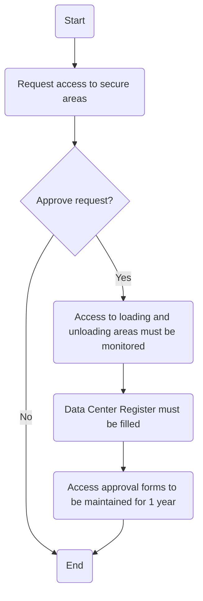

### 1. Process Name
Access Secure Areas Procedure

### 2. Roles (Swimlanes)
- Requestor
- IT & Cybersecurity Manager
- IT Network and Server Admin

### 3. Steps in Markdown Table

| Step # | Role                      | Action                                                                 | Next Step/Logic     |
|--------|---------------------------|------------------------------------------------------------------------|---------------------|
| 1      | Requestor                 | Request IT Manager for access to secure areas.                         | 2                   |
| 2      | IT & Cybersecurity Manager| Approve request?                                                       | Yes: 3 / No: End    |
| 3      | IT Network and Server Admin | Access to loading and unloading areas must be monitored.               | 4                   |
| 4      | IT Network and Server Admin | Data Center Register must be filled.                                  | 5                   |
| 5      | IT Network and Server Admin | Access approval forms to be maintained for 1 year.                     | End                 |

### 4. Logic as Mermaid.js Code Block

