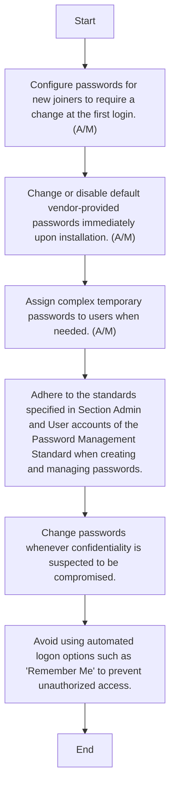

### Analysis of the Flowchart

1. **Process Name:**
   - User and System Accounts Admin Procedure

2. **Roles (Swimlanes):**
   - IT Network and Server Administrator
   - All Users

3. **Steps Extracted into a Markdown Table:**

   | Step # | Role                             | Action                                                                                             | Next Step/Logic |
   |--------|----------------------------------|----------------------------------------------------------------------------------------------------|-----------------|
   | 1      | IT Network and Server Administrator | Configure passwords for new joiners to require a change at the first login. (A/M)                   | Step 2          |
   | 2      | IT Network and Server Administrator | Change or disable default vendor-provided passwords immediately upon installation. (A/M)               | Step 3          |
   | 3      | IT Network and Server Administrator | Assign complex temporary passwords to users when needed. (A/M)                                        | Step 4          |
   | 4      | All Users                         | Adhere to the standards specified in Section Admin and User accounts of the Password Management Standard when creating and managing passwords. | Step 5          |
   | 5      | All Users                         | Change passwords whenever confidentiality is suspected to be compromised.                            | Step 6          |
   | 6      | All Users                         | Avoid using automated logon options such as "Remember Me" to prevent unauthorized access.            | End             |

4. **Mermaid.js Code:**

This structured breakdown provides a clear path through the User and System Accounts Admin Procedure, delineating responsibilities between the IT Network and Server Administrator and all users.