### Analysis of Incident Management Procedure Flowchart

1. **Process Name**: Incident Management Procedure

2. **Roles (Swimlanes)**:
   - Notifier
   - IT Network and Server Admin
   - IT & Cybersecurity Manager
   - CFO

3. **Steps in a Markdown Table**:

| Step # | Role                      | Action                                                                                  | Next Step/Logic            |
|--------|---------------------------|-----------------------------------------------------------------------------------------|----------------------------|
| 1      | Notifier                  | Report the incident to the relevant stakeholder.                                        | 2                          |
| 2      | IT Network and Server Admin | Collect details such as contact name and number, type of data, location/department of the incident. | 3                          |
| 3      | IT Network and Server Admin | Verify the occurrence of the incident and contain it to avoid further spreading.        | 4                          |
| 4      | IT Network and Server Admin | Determine the attack vector for the incident.                                           | 5                          |
| 5      | IT Network and Server Admin | Analyze the incident and determine the impact and severity. Report the incident to IT Manager. | S1-S3                      |
| S1-S3  | IT & Cybersecurity Manager | Decision point for steps 1-3 approval.                                                  | Approve: 8, No: 2          |
| 8      | IT Network and Server Admin | Collect evidence such as logs, system snapshots, CCTV footage, etc.                     | 9                          |
| 9      | IT Network and Server Admin | Contain the incident and prepare for recovery.                                          | 10                         |
| 10     | IT Network and Server Admin | Analyze the incident to determine the underlying issues that caused it.                | 11                         |
| 11     | IT Network and Server Admin | Record the findings of the root cause analysis in the incident reporting form.           | 12                         |
| 12     | IT Network and Server Admin | Implement corrective and preventive actions based on the root cause analysis to prevent recurrence. | 13                         |
| 13     | IT & Cybersecurity Manager | Secure all gathered evidence, document lessons learned, and update the CFO about incident closure. | Approve (CFO): 14          |
| 14     | IT & Cybersecurity Manager | Collect feedback from all relevant stakeholders involved in incident handling.           | 15                         |
| 15     | IT Network and Server Admin | Review the outcomes of the incident to assess the effectiveness of the response.         | 16                         |
| 16     | IT Network and Server Admin | Document lessons learned and areas for improvement to enhance future incident management practices. | 17                         |
| 17     | IT Network and Server Admin | Follow up with the team after one week for the implementation status of corrective actions. | End                        |

4. **Mermaid.js Code Block**:

```mermaid
graph TD;
    Start --> Step1[Report the incident to the relevant stakeholder.]
    Step1 --> Step2[Collect details such as contact name and number, type of data, location/department of the incident.]
    Step2 --> Step3[Verify the occurrence of the incident and contain it to avoid further spreading.]
    Step3 --> Step4[Determine the attack vector for the incident.]
    Step4 --> Step5[Analyze the incident and determine the impact and severity. Report to IT Manager.]
    Step5 --> Decision1{S1-S3 Approved?}
    Decision1 -- Yes --> Step8[Collect evidence such as logs, system snapshots, CCTV footage, etc.]
    Decision1 -- No --> Step2
    Step8 --> Step9[Contain the incident and prepare for recovery.]
    Step9 --> Step10[Analyze the incident to determine underlying issues.]
    Step10 --> Step11[Record findings of root cause analysis.]
    Step11 --> Step12[Implement corrective and preventive actions.]
    Step12 --> Step13[Secure all gathered evidence, document lessons learned, update CFO about incident closure.]
    Step13 --> CFOApproval{CFO Approval?}
    CFOApproval -- Approve --> Step14[Collect feedback from stakeholders.]
    Step14 --> Step15[Review outcomes to assess response effectiveness.]
    Step15 --> Step16[Document lessons learned, areas for improvement.]
    Step16 --> Step17[Follow up after one week on corrective actions.]
    Step17 --> End
```

This flowchart outlines the steps involved in managing an incident from initial reporting to follow-up and documentation. Each decision point and subsequent actions are mapped for clarity.