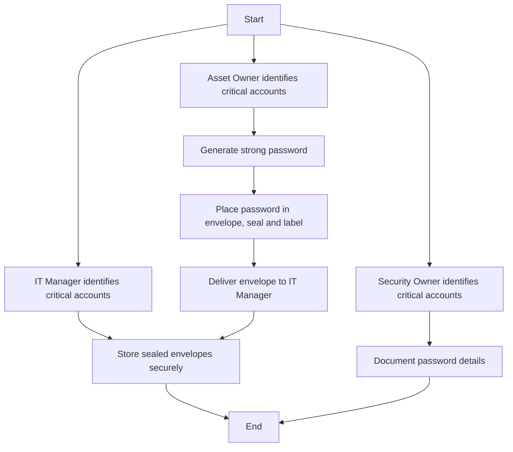

### 1. Process Name

Password Envelope Deposit Procedure

### 2. Roles (Swimlanes)

- IT & Cybersecurity Manager
- Asset Owner
- Security Team
- IT Network and System Admin

### 3. Markdown Table of Steps

| Step # | Role                      | Action                                                                                                 | Next Step/Logic    |
|--------|---------------------------|--------------------------------------------------------------------------------------------------------|---------------------|
| 1      | IT & Cybersecurity Manager | IT Manager must identify critical server and application privilege accounts that require secure password management. (A/M) | Step 5              |
| 1      | Asset Owner               | Asset Owner must identify critical server and application privilege accounts that require secure password management. (A/M) | Step 2              |
| 1      | Security Team             | Security Owner must identify critical server and application privilege accounts that require secure password management. (A/M) | Step 6              |
| 2      | Asset Owner               | Generate a strong password following the guidelines specified in the Password Guidelines section. (M) | Step 3              |
| 3      | Asset Owner               | Place the password in an envelope, seal it, and label it with the relevant details. (M)                | Step 4              |
| 4      | Asset Owner               | Deliver the sealed envelope to the IT Manager for secure storage. (M)                                  | Step 5              |
| 5      | IT & Cybersecurity Manager | The IT Manager must store the sealed envelopes in a secure, locked location to prevent unauthorized access. (M) | -                   |
| 6      | IT Network and System Admin | Document the details of the password, including server/desktop/network device/host name, type of device, owner of the password, date of change, next scheduled change, password changed by, custodian of the password envelope, and verified by. (M) | End                 |

### 4. Mermaid.js Code Block

