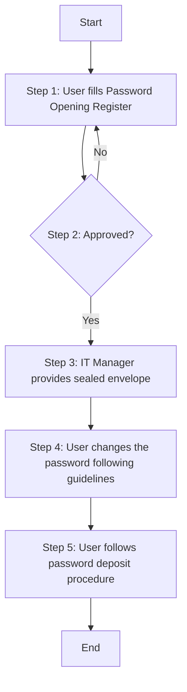

### 1. Process Name
**Password Retrieval Procedure**

### 2. Roles (Swimlanes)
- User
- IT & Cybersecurity Manager

### 3. Steps in Markdown Table

| Step # | Role                   | Action                                                                                                  | Next Step/Logic          |
|--------|------------------------|---------------------------------------------------------------------------------------------------------|--------------------------|
| 1      | User                   | The user must fill the Password Opening Register, documenting the date of opening, user, team, reason, date of replacement, signature of the user, and signature of password owner. (M) | Step 2                   |
| 2      | IT & Cybersecurity Manager | Approved?                                                                                               | Yes: Step 3 / No: Step 1 |
| 3      | IT & Cybersecurity Manager | After approval, the IT Manager provides the sealed envelope to the user. (M)                              | Step 4                   |
| 4      | User                   | Upon retrieving the password, the user must change the password following the Strong Password guidelines (M) | Step 5                   |
| 5      | User                   | The user must follow the password deposit procedure to securely store the new password. (M)               | End                      |

### 4. Mermaid.js Logic

