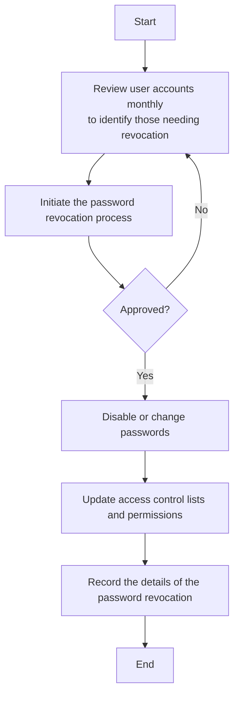

### Analysis of Flowchart

#### 1. Process Name
- Password Revocation Procedure

#### 2. Roles (Swimlanes)
- IT Network and Server Admin
- IT & Cybersecurity Manager

#### 3. Steps in Markdown Table

| Step # | Role                      | Action                                                                                      | Next Step/Logic          |
|--------|---------------------------|---------------------------------------------------------------------------------------------|--------------------------|
| 1      | IT Network and Server Admin | Review user accounts monthly to identify those that require password revocation. (A/M)      | Step 2                   |
| 2      | IT Network and Server Admin | Initiate the password revocation process for the relevant accounts. (M)                     | Approval Decision        |
| 3      | IT & Cybersecurity Manager  | Approved?                                                                                   | Yes: Step 4, No: Step 1  |
| 4      | IT Network and Server Admin | Disable or change passwords for identified accounts. (A/M)                                  | Step 5                   |
| 5      | IT Network and Server Admin | Update access control lists and permissions to prevent unauthorized access. (A/M)           | Step 6                   |
| 6      | IT Network and Server Admin | Record the details of the password revocation in the appropriate register. (M)              | End                      |

#### 4. Mermaid.js Code Block

This Mermaid.js code block visualizes the flowchart, ensuring that decision paths, such as the approval decision, are clearly represented.