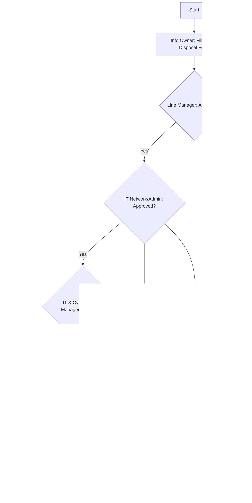

### Flowchart Analysis

1. **Process Name**: Media Disposal Procedure

2. **Roles (Swimlanes)**:
   - Information Owner
   - Line Manager
   - IT Network and Server Admin
   - IT & Cybersecurity Manager
   - CFO
   - Finance

3. **Steps in Markdown Table**:

| Step # | Role                       | Action                                                                 | Next Step/Logic                                 |
|--------|----------------------------|------------------------------------------------------------------------|-------------------------------------------------|
| 1      | Information Owner          | Identify information for disposal and fill Media Disposal Form if needed.| Proceed to Approval by Line Manager             |
| 2      | Line Manager               | Approved?                                                              | Yes: IT Network and Server Admin Approval; No: End |
| 3      | IT Network and Server Admin| Dispose of document/media in the presence of Information Owner.        | End                                             |
| 4      | IT Network and Server Admin| Approved?                                                              | Yes: IT & Cybersecurity Manager Approval; No: End|
| 5      | IT & Cybersecurity Manager | Approved?                                                              | Yes: CFO Approval; No: End                      |
| 6      | CFO                        | Approved?                                                              | Yes: Update Asset Inventory; No: End            |
| 7      | Finance                    | Update the asset inventory for backup media.                           | End                                             |
| 8      | Finance                    | Maintain Disposal Media form for 3 years.                              | End                                             |

4. **Mermaid.js Code Block**:

This provides a structured overview of the process with decision points explicitly traced back to the relevant steps.