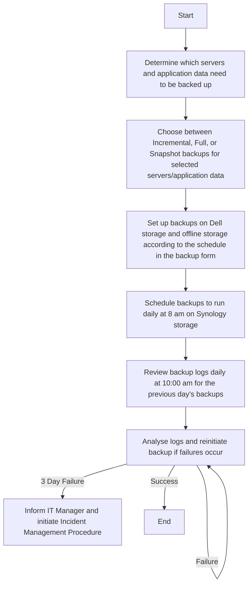

Sure, here's the analysis:

### 1. Process Name:
**Local Servers Backup Procedure**

### 2. Roles (Swimlanes):
- **IT Network and System Admin**

### 3. Steps in Markdown Table:

| Step # | Role                     | Action                                                                                                                                                       | Next Step/Logic                                                                                                |
|--------|--------------------------|--------------------------------------------------------------------------------------------------------------------------------------------------------------|---------------------------------------------------------------------------------------------------------------|
| 1      | IT Network and System Admin | Determine which servers and application data need to be backed up (M)                                                                                       | Step 2                                                                                                        |
| 2      | IT Network and System Admin | Choose between Incremental, Full, or Snapshot backups for selected servers/application data. (M)                                                            | Step 3                                                                                                        |
| 3      | IT Network and System Admin | Set up backups on Dell storage and offline storage according to the schedule in the backup form. (M)                                                        | Step 4                                                                                                        |
| 4      | IT Network and System Admin | Schedule backups to run daily at 8 am on Synology storage. (M)                                                                                              | Step 5                                                                                                        |
| 5      | IT Network and System Admin | Review backup logs daily at 10:00 am for the previous day's backups. (M)                                                                                    | Step 6                                                                                                        |
| 6      | IT Network and System Admin | Analyse logs and reinitiate backup if failures occur. If the same backup job fails for three consecutive days, inform the IT Manager, and initiate the Incident Management Procedure. (M) | End                                                                                                           |

### 4. Logic in Mermaid.js Code Block:

