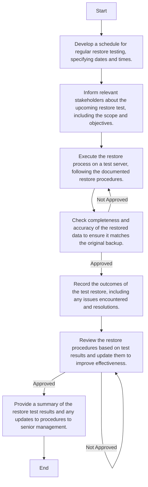

Certainly! Here's the analysis of the flowchart:

### 1. Process Name
- **Restore Testing Procedure**

### 2. Roles (Swimlanes)
- **IT Network and System Admin**
- **IT & Cybersecurity Manager**

### 3. Steps Extracted into a Markdown Table

| Step # | Role                     | Action                                                                                              | Next Step/Logic                      |
|--------|--------------------------|-----------------------------------------------------------------------------------------------------|--------------------------------------|
| 1      | IT Network and System Admin | Develop a schedule for regular restore testing, specifying dates and times.                            | Step 3                               |
| 3      | IT Network and System Admin | Inform relevant stakeholders about the upcoming restore test, including the scope and objectives.     | Step 4                               |
| 4      | IT Network and System Admin | Execute the restore process on a test server, following the documented restore procedures.            | Step 5                               |
| 5      | IT Network and System Admin | Check completeness and accuracy of the restored data to ensure it matches the original backup.         | Approved?                            |
| 6      | IT Network and System Admin | Record the outcomes of the test restore, including any issues encountered and resolutions.             | Step 7                               |
| 7      | IT Network and System Admin | Review the restore procedures based on test results and update them to improve effectiveness.          | Approved?                            |
| -      | IT & Cybersecurity Manager | Approval after completeness and accuracy check.                                                          | Yes: Step 6 / No: Step 4             |
| -      | IT & Cybersecurity Manager | Approval after reviewing restore procedures.                                                              | Yes: Step 9 / No: Step 7             |
| 9      | IT Network and System Admin | Provide a summary of the restore test results and any updates to procedures to senior management.      | End                                  |

### 4. Mermaid.js Code Block

This representation maintains the logical flow and decisions from the flowchart in structured formats.