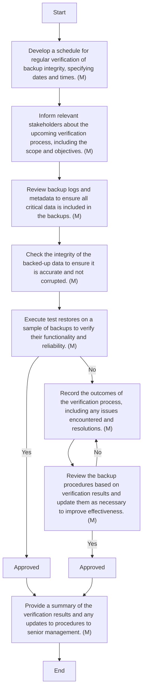

### Analysis

1. **Process Name**: Backup Integrity Verification Procedure

2. **Roles (Swimlanes)**:
   - IT Network and System Admin
   - IT & Cybersecurity Manager

3. **Steps in Markdown Table**:

| Step # | Role                      | Action                                                                 | Next Step/Logic               |
|--------|---------------------------|------------------------------------------------------------------------|-------------------------------|
| 1      | IT Network and System Admin | Develop a schedule for regular verification of backup integrity, specifying dates and times. (M) | Step 2                        |
| 2      | IT Network and System Admin | Inform relevant stakeholders about the upcoming verification process, including the scope and objectives. (M) | Step 3                        |
| 3      | IT Network and System Admin | Review backup logs and metadata to ensure all critical data is included in the backups. (M) | Step 4                        |
| 4      | IT Network and System Admin | Check the integrity of the backed-up data to ensure it is accurate and not corrupted. (M) | Step 5                        |
| 5      | IT Network and System Admin | Execute test restores on a sample of backups to verify their functionality and reliability. (M) | Approval Decision (Yes/No)    |
| 6      | IT Network and System Admin | Record the outcomes of the verification process, including any issues encountered and resolutions. (M) | Step 7                        |
| 7      | IT Network and System Admin | Review the backup procedures based on verification results and update them as necessary to improve effectiveness. (M) | Approval Decision (Yes/No)    |
| 8      | IT & Cybersecurity Manager | Approved                                                                 | Step 9                        |
| 9      | IT & Cybersecurity Manager | Provide a summary of the verification results and any updates to procedures to senior management. (M) | End (Yes)                     |

4. **Mermaid.js Code Block**:

