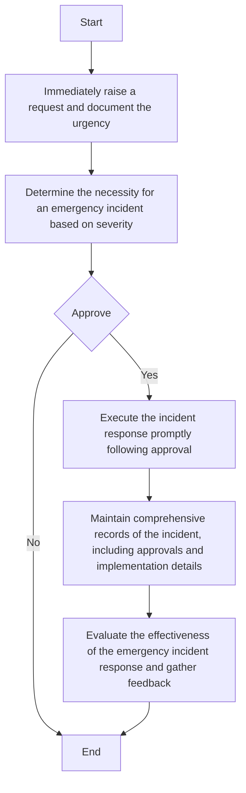

### Analysis

1. **Process Name**: Emergency Incident Protocol Procedure

2. **Roles (Swimlanes)**:
   - Notifier
   - IT & Cybersecurity Manager
   - CFO
   - IT Network and Server Admin

3. **Steps in Markdown Table**

| Step # | Role                        | Action                                                                     | Next Step/Logic               |
|--------|-----------------------------|----------------------------------------------------------------------------|-------------------------------|
| 1      | Notifier                    | Immediately raise a request and document the urgency.                      | Step 2                        |
| 2      | IT & Cybersecurity Manager  | Determine the necessity for an emergency incident based on severity.       | Approval by CFO               |
| 3      | CFO                         | Approve                                                                    | Yes: Step 4 / No: End         |
| 4      | IT Network and Server Admin | Execute the incident response promptly following approval.                 | Step 5                        |
| 5      | IT Network and Server Admin | Maintain comprehensive records of the incident, including approvals and implementation details. | Step 6                        |
| 6      | IT Network and Server Admin | Evaluate the effectiveness of the emergency incident response and gather feedback. | End                           |

4. **Mermaid.js Code Block**

