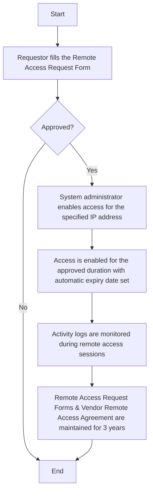

### Analysis of Flowchart Image

#### 1. Process Name:
- Remote Access Procedure

#### 2. Roles (Swimlanes):
- Requestor
- Line Manager/IT & Cybersecurity Manager
- IT Network and System Admin

#### 3. Steps in Markdown Table

| Step # | Role                                    | Action                                                                                     | Next Step/Logic                                  |
|--------|-----------------------------------------|--------------------------------------------------------------------------------------------|--------------------------------------------------|
| 1      | Requestor                               | Requester fills the Remote Access Request Form. For vendors, the concerned department fills the form. | Approved?                                        |
| 2      | Line Manager/IT & Cybersecurity Manager | Approval Process                                                                           | Yes: Step 3, No: End                             |
| 3      | IT Network and System Admin             | System administrator enables access for the specified IP address.                           | Step 4                                           |
| 4      | IT Network and System Admin             | Access is enabled for the approved duration with automatic expiry date set.                 | Step 5                                           |
| 5      | IT Network and System Admin             | Activity logs are monitored during remote access sessions.                                  | Step 6                                           |
| 6      | IT Network and System Admin             | Remote Access Request Forms & Vendor Remote Access Agreement are maintained for 3 years.    | End                                              |

#### 4. Mermaid.js Code Block

