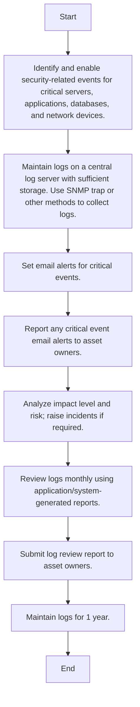

### Analysis of the Flowchart

1. **Process Name**: Security Log Monitoring Procedure

2. **Roles (Swimlanes)**: IT Network and System Admin

3. **Steps Extracted into Markdown Table**

```markdown
| Step # | Role                    | Action                                                                                 | Next Step/Logic     |
|--------|-------------------------|----------------------------------------------------------------------------------------|---------------------|
| 1      | IT Network and System Admin | Identify and enable security-related events for critical servers, applications, databases, and network devices. | Step 2              |
| 2      | IT Network and System Admin | Maintain logs on a central log server with sufficient storage. Use SNMP trap or other methods to collect logs.   | Step 3              |
| 3      | IT Network and System Admin | Set email alerts for critical events.                                                   | Step 4              |
| 4      | IT Network and System Admin | Report any critical event email alerts to asset owners.                                 | Step 5              |
| 5      | IT Network and System Admin | Analyze impact level and risk; raise incidents if required.                            | Step 6              |
| 6      | IT Network and System Admin | Review logs monthly using application/system-generated reports.                         | Step 7              |
| 7      | IT Network and System Admin | Submit log review report to asset owners.                                              | Step 8              |
| 8      | IT Network and System Admin | Maintain logs for 1 year.                                                              | End                 |
```

4. **Mermaid.js Code Block**

