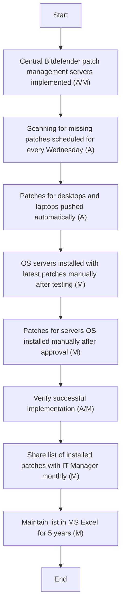

Here's the analysis of the flowchart:

### 1. Process Name
- Patch Management Procedure (Server, Application, Desktop)

### 2. Roles (Swimlanes)
- IT Network and Server Admin

### 3. Steps in Markdown Table

| Step # | Role                      | Action                                                                 | Next Step/Logic                               |
|--------|---------------------------|------------------------------------------------------------------------|-----------------------------------------------|
| 1      | IT Network and Server Admin | Central Bitdefender patch management servers will be implemented for servers, desktops, and laptops connected to the Arabian Mills IT network (A/M). | Step 2                                        |
| 2      | IT Network and Server Admin | Scanning for missing patches will be scheduled for every Wednesday (A). | Step 3                                        |
| 3      | IT Network and Server Admin | Patches for desktops and laptops will be pushed automatically by the Bitdefender Patch management server (A). | Step 4                                        |
| 4      | IT Network and Server Admin | Windows and non-Windows operating system servers will be installed with the latest patches manually, after proper testing and verifying successful backup (M). | Step 5                                        |
| 5      | IT Network and Server Admin | Patches for servers OS and applications will be installed manually, following proper approval and the change management process (M). | Step 6                                        |
| 6      | IT Network and Server Admin | Verify successful implementation of patches for servers OS and applications after completion (A/M). | Step 7                                        |
| 7      | IT Network and Server Admin | Share the list of installed patches on servers and applications with the IT Manager monthly (M). | Step 8                                        |
| 8      | IT Network and Server Admin | List of installed patches on servers and applications will be maintained in MS Excel and retained for 5 years (M). | End                                           |

### 4. Logic as a Mermaid.js Code Block

This representation should help in understanding and automating the flow effectively.