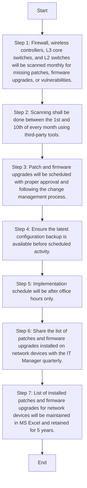

### Analysis of the Flowchart

1. **Process Name**: Patch Management Procedure (Network Devices)

2. **Roles (Swimlanes)**:
   - IT Network and Server Admin

3. **Steps as a Markdown Table**:

| Step # | Role                     | Action                                                                                                           | Next Step/Logic         |
|--------|--------------------------|------------------------------------------------------------------------------------------------------------------|-------------------------|
| 1      | A/M                      | Firewall, wireless controllers, L3 core switches, and L2 switches will be scanned monthly for missing patches, firmware upgrades, or vulnerabilities. | Step 2                  |
| 2      | A/M                      | Scanning shall be done between the 1st and 10th of every month using third-party tools.                          | Step 3                  |
| 3      | M                        | Patch and firmware upgrades will be scheduled with proper approval and following the change management process.  | Step 4                  |
| 4      | A/M                      | Ensure the latest configuration backup is available before scheduled activity.                                   | Step 5                  |
| 5      | M                        | Implementation schedule will be after office hours only.                                                          | Step 6                  |
| 6      | M                        | Share the list of patches and firmware upgrades installed on network devices with the IT Manager quarterly.     | Step 7                  |
| 7      | M                        | List of installed patches and firmware upgrades for network devices will be maintained in MS Excel and retained for 5 years.                        | End                     |

4. **Mermaid.js Code Block**:

