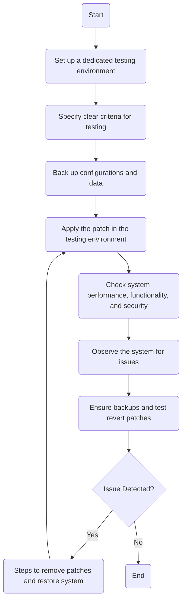

### 1. Identify the 'Process Name'.

Patch Testing Procedure

### 2. Identify all 'Roles' (Swimlanes).

- IT Network and Server Admin

### 3. Extract every step into a Markdown table.

| Step # | Role                       | Action                                                                                      | Next Step/Logic                          |
|--------|----------------------------|---------------------------------------------------------------------------------------------|------------------------------------------|
| 1      | IT Network and Server Admin| Set up a dedicated testing environment that mirrors the production environment as closely as possible (A/M) | Step 2                                   |
| 2      | IT Network and Server Admin| Specify clear criteria for successful testing of patches (M)                                | Step 3                                   |
| 3      | IT Network and Server Admin| Back up current configurations and data before applying patches (A/M)                        | Step 4                                   |
| 4      | IT Network and Server Admin| Apply the patch in the testing environment (M)                                               | Step 5                                   |
| 5      | IT Network and Server Admin| Check system performance, functionality, and security post-patch (A/M)                        | Step 6                                   |
| 6      | IT Network and Server Admin| Observe the system for a predefined period to detect any issues (A/M)                        | Step 7                                   |
| 7      | IT Network and Server Admin| Ensure backups are available and tested to revert patches if issues are identified during testing (M) | Condition (Issue Detected?)              |
| 8      | IT Network and Server Admin| Steps to remove the patch and restore the system to its previous state if issues are identified (M) | Step 4 if issues, End if resolved (A/M)   |

### 4. Provide the logic as a Mermaid.js code block.

