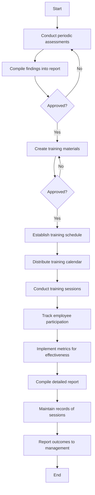

### Analysis

1. **Process Name**: Acceptable Usage Training Programs Procedure

2. **Roles (Swimlanes)**:
   - IT Network and Server Administrator
   - IT & Cybersecurity Manager

3. **Steps as a Markdown Table**

   | Step # | Role                      | Action                                                                                             | Next Step/Logic             |
   |--------|---------------------------|----------------------------------------------------------------------------------------------------|-----------------------------|
   | 1      | IT Network and Server Administrator | Conduct periodic assessments to identify specific training needs and evaluate knowledge levels among employees. | Step 2                      |
   | 2      | IT Network and Server Administrator | Compile findings from the assessment into a detailed training needs report for review.             | Approved?                   |
   | 3      | IT & Cybersecurity Manager  | Approved? (Decision)                                                                               | Yes: Step 4, No: Step 1     |
   | 4      | IT Network and Server Administrator | Create training materials covering all aspects of acceptable usage guidelines.                      | Approved?                   |
   | 5      | IT & Cybersecurity Manager  | Approved? (Decision)                                                                               | Yes: Step 6, No: Step 4     |
   | 6      | IT Network and Server Administrator | Establish and communicate a regular training schedule.                                              | Step 7                      |
   | 7      | IT Network and Server Administrator | Distribute the training calendar to all employees.                                                 | Step 8                      |
   | 8      | IT Network and Server Administrator | Conduct training sessions using various delivery methods.                                          | Step 9                      |
   | 9      | IT Network and Server Administrator | Track employee participation and attendance during training sessions.                               | Step 10                     |
   | 10     | IT & Cybersecurity Manager  | Implement metrics to assess the effectiveness of training programs.                                 | Step 11                     |
   | 11     | IT Network and Server Administrator | Use evaluation results to compile a detailed report on training effectiveness.                      | Step 12                     |
   | 12     | IT Network and Server Administrator | Maintain records of training sessions.                                                             | Step 13                     |
   | 13     | IT & Cybersecurity Manager  | Report training outcomes and improvements to senior management.                                    | End                         |

4. **Mermaid.js Code**

