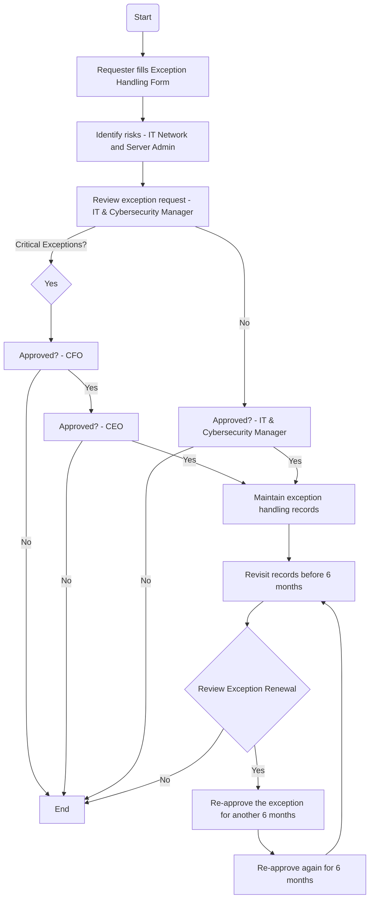

### Analysis

1. **Process Name:**
   - Exception Handling Procedure

2. **Roles (Swimlanes):**
   - Requestor
   - IT Network and Server Admin
   - IT & Cybersecurity Manager
   - CFO
   - CEO

3. **Steps as a Markdown Table:**

```markdown
| Step # | Role                       | Action                                                                                          | Next Step/Logic                                |
|--------|----------------------------|-------------------------------------------------------------------------------------------------|------------------------------------------------|
| 1      | Requestor                  | Fill the Exception Handling Form and attach relevant documents                                  | Step 2                                         |
| 2      | IT Network and Server Admin| Identify risks and review exception details                                                     | Step 3                                         |
| 3      | IT & Cybersecurity Manager | Review the exception request and associated risks                                               | Critical Exceptions: Yes -> Step 7, No -> Approve check |
| 4      | IT & Cybersecurity Manager | Critical Exceptions?                                                                           | No -> Approved check, Yes -> Step 5            |
| 5      | CFO                        | Approve the exceptions?                                                                         | No -> End, Yes -> Step 6                     |
| 6      | CEO                        | Approve the exceptions?                                                                         | No -> End, Yes -> Step 7                     |
| 7      | IT Network and Server Admin| Maintain exception handling records                                                             | Step 8                                         |
| 8      | IT Network and Server Admin| Revisit records before end of 6 months to review possibility of revocation                      | Approved check                                 |
| 9      | IT & Cybersecurity Manager | Exception Renewal?                                                                             | No -> End, Yes -> Step 10                      |
| 10     | IT & Cybersecurity Manager | Re-approve the exception for another 6 months                                                   | Step 11                                        |
| 11     | IT Network and Server Admin| Re-approve the exception for another 6 months                                                   | Return to Step 8                               |
```

4. **Mermaid.js Code Block:**



This structured breakdown summarizes the flowchart and translates it into a clearly defined process for an AI agent.