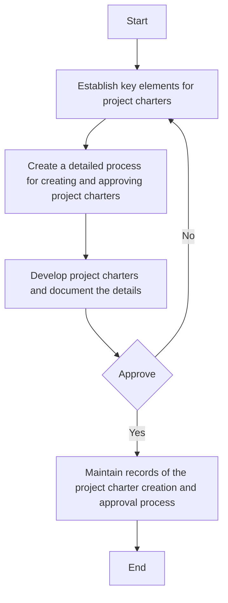

### Analysis of Flowchart

1. **Process Name**: Project Charter Creation Procedure

2. **Roles (Swimlanes)**:
   - IT Project Manager
   - IT & Cybersecurity Manager

3. **Steps Extracted into a Markdown Table**:

   | Step # | Role                     | Action                                                                               | Next Step/Logic       |
   |--------|--------------------------|--------------------------------------------------------------------------------------|-----------------------|
   | 1      | IT Project Manager       | Establish key elements for project charters, including objectives, scope, stakeholders, budget, and timeline. (M)  | Step 2                |
   | 2      | IT Project Manager       | Create a detailed process for creating and approving project charters. (M)            | Step 3                |
   | 3      | IT Project Manager       | Develop project charters based on predefined elements and document the details. (M)   | Approval Decision     |
   | 4      | IT & Cybersecurity Manager | Approve                                                                              | Yes: Step 5; No: Step 1 |
   | 5      | IT Project Manager       | Maintain records of the project charter creation and approval process. (M)            | End                   |

4. **Mermaid.js Code Block**:

