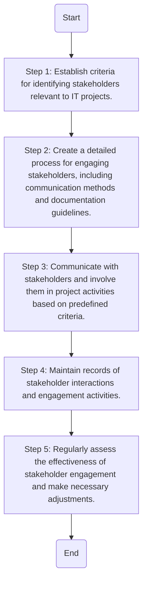

### Analysis of the Flowchart

1. **Process Name**: Stakeholder Identification and Engagement Procedure

2. **Roles (Swimlanes)**: 
   - IT Project Manager

3. **Steps in Markdown Table**

```markdown
| Step # | Role              | Action                                                                 | Next Step/Logic    |
|--------|-------------------|------------------------------------------------------------------------|--------------------|
| 1      | IT Project Manager | Establish criteria for identifying stakeholders relevant to IT projects. | Step 2             |
| 2      | IT Project Manager | Create a detailed process for engaging stakeholders, including communication methods and documentation guidelines. | Step 3             |
| 3      | IT Project Manager | Communicate with stakeholders and involve them in project activities based on predefined criteria. | Step 4             |
| 4      | IT Project Manager | Maintain records of stakeholder interactions and engagement activities. | Step 5             |
| 5      | IT Project Manager | Regularly assess the effectiveness of stakeholder engagement and make necessary adjustments. | End                |
```

4. **Mermaid.js Code Block**

