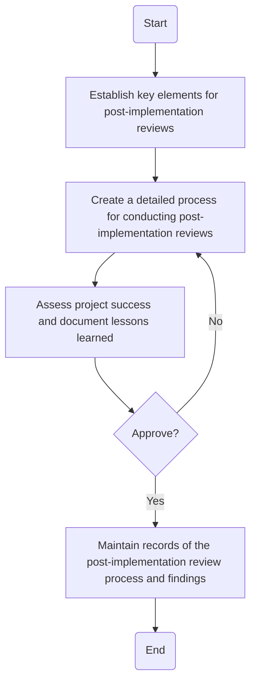

### Analysis of the Flowchart

#### 1. Process Name:
- Post-Implementation Review Procedure

#### 2. Roles (Swimlanes):
- IT Project Manager
- IT & Cybersecurity Manager

#### 3. Markdown Table of Steps:

| Step # | Role                  | Action                                                                 | Next Step/Logic                 |
|--------|-----------------------|------------------------------------------------------------------------|---------------------------------|
| 1      | IT Project Manager    | Establish key elements for post-implementation reviews, including success criteria, lessons learned, and best practices. | Go to Step 2                    |
| 2      | IT Project Manager    | Create a detailed process for conducting post-implementation reviews.  | Go to Step 3                    |
| 3      | IT Project Manager    | Assess project success and document lessons learned based on predefined elements. | Go to 'Approve' Decision       |
| 4      | IT & Cybersecurity Manager | Approve?                                    | Yes: Go to Step 5, No: Go to Step 3 |
| 5      | IT Project Manager    | Maintain records of the post-implementation review process and findings. | End                             |

#### 4. Logic as Mermaid.js Code Block:

