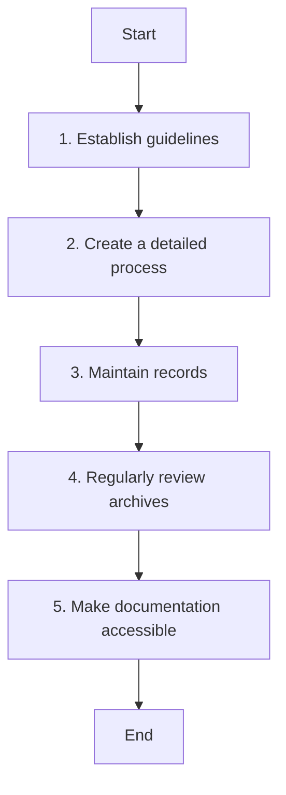

Sure! Here’s the analysis of the flowchart:

### 1. Process Name
Documentation and Archiving Procedure

### 2. Roles (Swimlanes)
- IT Project Manager

### 3. Steps in Markdown Table

| Step # | Role              | Action                                                                                     | Next Step/Logic                         |
|--------|-------------------|--------------------------------------------------------------------------------------------|-----------------------------------------|
| 1      | IT Project Manager| Establish guidelines for archiving project documentation, including completeness and accuracy requirements. | Go to Step 2                            |
| 2      | IT Project Manager| Create a detailed process for archiving and maintaining project documentation.              | Go to Step 3                            |
| 3      | IT Project Manager| Maintain records of project activities and archive documentation based on predefined guidelines. | Go to Step 4                            |
| 4      | IT Project Manager| Regularly review archived documentation to ensure completeness and accuracy.                | Go to Step 5                            |
| 5      | IT Project Manager| Make archived project documentation accessible to relevant stakeholders for review and audits. | End                                     |

### 4. Logic in Mermaid.js

This flowchart details a process managed by the IT Project Manager for establishing and maintaining a systematic archiving process.