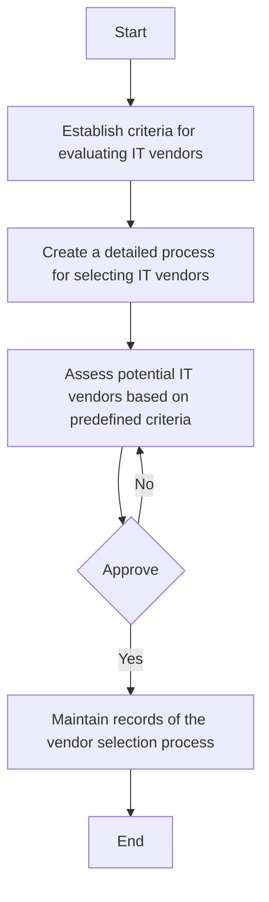

1. **Process Name**: Vendor Selection Procedure

2. **Roles (Swimlanes)**:
   - IT Network and Server Admin
   - IT & Cybersecurity Manager

3. **Markdown Table**:

| Step # | Role                        | Action                                                                                       | Next Step/Logic     |
|--------|-----------------------------|----------------------------------------------------------------------------------------------|---------------------|
| 1      | IT Network and Server Admin | Establish criteria for evaluating IT vendors based on business needs, technical requirements, and vendor capabilities. | Step 2              |
| 2      | IT Network and Server Admin | Create a detailed process for selecting IT vendors, including steps for evaluation and approval. | Step 3              |
| 3      | IT Network and Server Admin | Assess potential IT vendors based on predefined criteria, including experience, reliability, cost, and technical capabilities. | Approve             |
| 4      | IT & Cybersecurity Manager  | Approve                                                                                       | Yes: Step 5, No: Step 3 |
| 5      | IT Network and Server Admin | Maintain records of the vendor selection process, including evaluation criteria, assessment results, and approvals. | End                 |

4. **Mermaid.js Code Block**:

