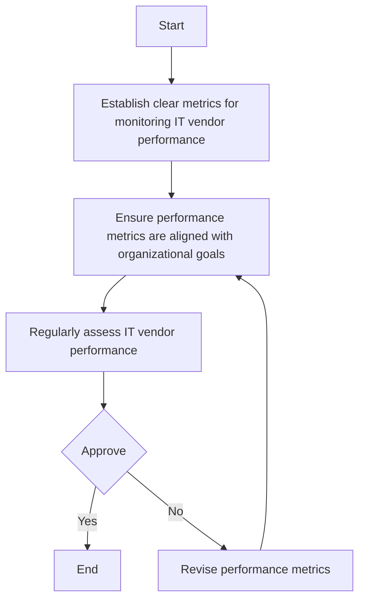

### Analysis of the Flowchart

#### 1. Process Name
Performance Metric and Alignment Procedure

#### 2. Roles (Swimlanes)
- IT Network and Server Admin
- IT & Cybersecurity Manager

#### 3. Steps in a Markdown Table

| Step # | Role                       | Action                                                                                               | Next Step/Logic  |
|--------|----------------------------|------------------------------------------------------------------------------------------------------|------------------|
| 1      | IT Network and Server Admin | Establish clear metrics for monitoring IT vendor performance, including service quality, delivery timelines, and cost-effectiveness. | 2                |
| 2      | IT Network and Server Admin | Ensure performance metrics are aligned with organizational goals to support business success.         | 3                |
| 3      | IT Network and Server Admin | Regularly assess IT vendor performance based on predefined metrics and document findings.            | Approve          |
| Approve| IT & Cybersecurity Manager   | Decision point: Approve the assessment and findings.                                                      | Yes: End, No: 5  |
| 5      | IT Network and Server Admin | Revise performance metrics based on feedback and evolving business objectives.                       | 2                |

#### 4. Logic as Mermaid.js Code Block

This flowchart represents a procedure for aligning IT vendor performance metrics with organizational goals, involving assessment and revision steps as part of a continuous improvement process.