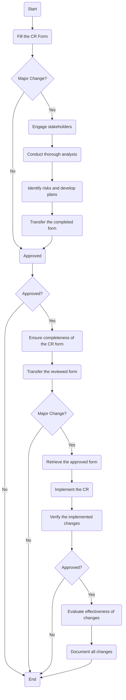

Sure, here is the analysis of the flowchart:

### 1. Process Name
- Change Management Procedure

### 2. Roles (Swimlanes)
- Change Requestor
- BU Head
- IT & Cybersecurity Manager
- IT Network and Server Admin
- CFO

### 3. Steps Table

| Step # | Role                        | Action                                                                                 | Next Step/Logic                    |
|--------|-----------------------------|----------------------------------------------------------------------------------------|------------------------------------|
| 1      | Change Requestor            | Fill the Change Request (CR) Form and ensure completeness of information.               | Major Change Decision              |
| 2      | Change Requestor            | Major Change Decision                                                                  | Yes: Step 3, No: Approved          |
| 3      | BU Head                     | Engage stakeholders from various departments during change planning and approval. (M)   | Step 4                             |
| 4      | BU Head                     | Conduct thorough analysis to understand the potential effects of changes. (M)           | Step 5                             |
| 5      | BU Head                     | Identify risks and develop plans to mitigate potential negative impacts. (M)            | Step 6                             |
| 6      | BU Head                     | Transfer the completed form to System Admin (M)                                         | Approved                           |
| 7      | IT Network and Server Admin | Ensure completeness of the CR form. (M)                                                 | Step 8                             |
| 8      | IT Network and Server Admin | Transfer the reviewed form to IT Manager (M)                                            | Major Change Decision              |
| 9      | IT & Cybersecurity Manager  | Major Change Decision                                                                  | Yes: Step 12, No: Approved         |
| 12     | IT & Cybersecurity Manager  | Retrieve the approved form. (M)                                                         | Step 13                            |
| 13     | IT & Cybersecurity Manager  | Implement the CR and follow the schedule defined. (M)                                   | Step 14                            |
| 14     | IT & Cybersecurity Manager  | Verify the implemented changes; Ensure changes are correctly applied. (M)               | Approved                           |
| 15     | IT Network and Server Admin | Evaluate the effectiveness of changes and gather feedback from stakeholders. (M)        | Step 16                            |
| 16     | IT Network and Server Admin | Document all changes comprehensively, including change request forms and logs. (M)      | End                                |

### 4. Mermaid.js Code Block

This representation provides an overview of the steps involved in the change management procedure, clearly indicating decision points and actions across different roles.