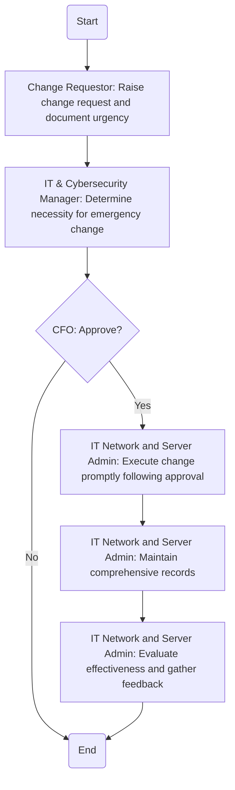

### Analysis of the Flowchart

#### 1. Process Name:
   - Emergency Change Protocol Procedure

#### 2. Roles (Swimlanes):
   - Change Requestor
   - IT & Cybersecurity Manager
   - CFO
   - IT Network and Server Admin

#### 3. Steps in Markdown Table:

| Step # | Role                      | Action                                                                                         | Next Step/Logic               |
|--------|----------------------------|------------------------------------------------------------------------------------------------|-------------------------------|
| 1      | Change Requestor           | Immediately raise a change request and document the urgency.                                   | Step 2                        |
| 2      | IT & Cybersecurity Manager | Determine the necessity for an emergency change based on incident severity.                    | Approve (Yes/No)              |
| 3      | CFO                        | Approve                                                                                         | Yes: Step 4, No: End          |
| 4      | IT Network and Server Admin| Execute the change promptly following approval.                                                | Step 5                        |
| 5      | IT Network and Server Admin| Maintain comprehensive records of the change, including approvals and implementation details.  | Step 6                        |
| 6      | IT Network and Server Admin| Evaluate the effectiveness of the emergency change and gather feedback.                        | End                           |

#### 4. Logic as Mermaid.js Code Block:

This analysis provides a structured breakdown of the flowchart into steps, roles, and logical flow for clear understanding and automation.