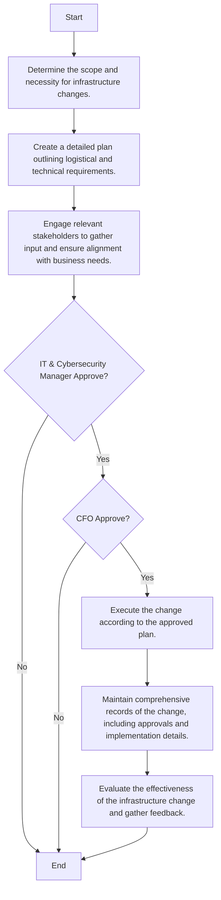

### Analysis

1. **Process Name:**
   - Infrastructure Changes Procedure

2. **Roles (Swimlanes):**
   - Change Requestor
   - IT Network and System Admin
   - IT & Cybersecurity Manager
   - CFO

3. **Steps in Markdown Table:**

   | Step # | Role                      | Action                                                                                  | Next Step/Logic        |
   |--------|---------------------------|-----------------------------------------------------------------------------------------|------------------------|
   | 1      | Change Requestor          | Determine the scope and necessity for infrastructure changes.                           | 2                      |
   | 2      | IT Network and System Admin | Create a detailed plan outlining logistical and technical requirements.                 | 3                      |
   | 3      | IT Network and System Admin | Engage relevant stakeholders to gather input and ensure alignment with business needs.  | IT & Cybersecurity Manager approves  |
   | 4      | IT & Cybersecurity Manager | Approve                                                                                  | Yes: CFO approves  No: End      |
   | 5      | CFO                       | Approve                                                                                  | Yes: 5  No: End                 |
   | 6      | IT Network and System Admin | Execute the change according to the approved plan.                                      | 6                      |
   | 7      | IT Network and System Admin | Maintain comprehensive records of the change, including approvals and implementation details. | 7                      |
   | 8      | IT Network and System Admin | Evaluate the effectiveness of the infrastructure change and gather feedback.           | End                    |

4. **Mermaid.js Code Block:**

