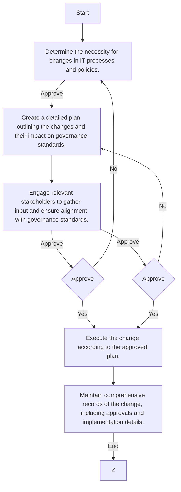

### Analysis

1. **Process Name:** IT Process and Policy Changes Procedure

2. **Roles (Swimlanes):**
   - IT & Cybersecurity Manager
   - IT Network and System Admin
   - CFO

3. **Steps into Markdown Table:**

| Step # | Role                      | Action                                                                 | Next Step/Logic |
|--------|---------------------------|------------------------------------------------------------------------|-----------------|
| 1      | IT & Cybersecurity Manager | Determine the necessity for changes in IT processes and policies.      | Approve         |
| 2      | IT Network and System Admin | Create a detailed plan outlining the changes and their impact on governance standards. | 3               |
| 3      | IT Network and System Admin | Engage relevant stakeholders to gather input and ensure alignment with governance standards. | Approve         |
| 4      | IT & Cybersecurity Manager | Approve (Decision)                                                    | Yes: 6, No: 1   |
| 5      | CFO                        | Approve (Decision)                                                    | Yes: 7, No: 2   |
| 6      | IT Network and System Admin | Execute the change according to the approved plan.                    | 7               |
| 7      | IT Network and System Admin | Maintain comprehensive records of the change, including approvals and implementation details. | End             |

4. **Mermaid.js Code Block:**

This provides a clear representation of the flowchart's logic and steps, delineating the roles involved and the decision-making paths.