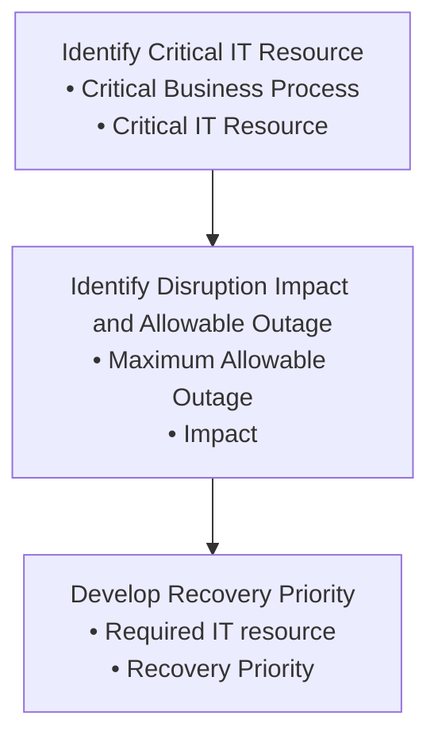

## Disaster Recovery

#### Purpose
Information technology (IT) and automated information systems are vital elements in Arabian Mills' business processes. Contingency planning supports this requirement by establishing thorough plans, procedures, and technical measures to enable a system/application to be recovered quickly and effectively following a service disruption or disaster.
#### Scope
This policy applies to all critical servers hosting applications and data used in Arabian Mills, managed by the IT department or third-party service providers. The IT Disaster Recovery (DR) plan focuses on IT system disruptions and not business processes. The purpose is to allow Arabian Mills to return to its daily operations as quickly as possible after an unforeseen event, protecting resources, minimizing customer inconvenience, and assigning specific responsibilities in the context of recovery.
#### Objectives
 Ensure the rapid and effective recovery of IT systems and applications following a disruption.
 Minimize downtime and data loss during IT system disruptions.
 Protect critical IT resources and infrastructure.
 Facilitate communication and coordination among recovery teams and stakeholders.
 Maintain business continuity and minimize customer inconvenience.
 Regularly test and update the IT DR plan to ensure its effectiveness.
#### Roles and Responsibilities
IT & Cybersecurity Manager
 Approve the IT DR Plan and Recovery Strategy.
 Approve Business Impact Analysis (BIA) and Risk Assessment (RA).
 Assign DR Plan coordinator and line of succession.
 Provide status updates to the BU head and CFO every 3 hours during a disaster.
 Ensure DR tests are conducted every 6 months.
 Review DR test results.
IT Team
 Develop Recovery Strategy.
 Assist BIA team in identifying assets involved in recovery.
 Assist DR Plan coordinator in DR testing.
Cybersecurity Team
 Ensure security is not compromised during IT DR implementation.
 Update the Cybersecurity committee about the status of IT DR Implementation and Recovery every hour.
 Oversee the BIA and RA process and assist BIA coordinator in RA.
 Oversee the DR Testing activity.
Asset Owner (BU Head)
 Assist IT & Cybersecurity Manager and IT Team in developing Recovery Strategy.
 Provide Recovery Time Objective (RTO).
 Approve BIA and RA.
 Assign department BIA coordinator to assist the BIA coordinator.
 Ensure DR tests are conducted regularly.
BIA Coordinator
 Conduct BIA and RA.
 Coordinate with IT team for gathering IT assets information.
 Coordinate with BU Head and internal team for BIA and RA.
 Assist IT team in developing Recovery Strategy.
DR Plan Coordinator
 Inform Damage Assessment Team to conduct damage assessment.
 Activate IT DR.
 Inform Recovery Team to initiate IT DR.
 Coordinate with Recovery Team for implementation of IT DR.
 Provide status updates to IT & Cybersecurity Manager and Security Team every hour.
 Maintain an up-to-date list of teams and civil services contacts.
 Share relevant contacts with the recovery team as required for IT DR.
 Test DR plan.
 Assign names to call tree.
 Conduct DR Training and awareness among different teams involved in DR activity.
 Coordinate and conduct DR testing.
Damage Assessment Team
 Conduct damage assessment.
 Coordinate with DR Plan coordinator for damage assessment.
 Get approval on Damage Assessment Form.
 Inform DR Plan coordinator upon completion of damage assessment.
Recovery Team
 Implement IT DR Plan upon activation.
 Assign an internal recovery team lead.
 Follow the instructions of the recovery team lead during the recovery process.
 Coordinate with IT Team, Vendors, etc., as per the IT DR Plan.
 Periodically inform DR Plan coordinator about IT DR implementation progress.
 Assist DR Plan coordinator during DR Testing.
#### IT Contingency Policy
1. An IT DRP to recover and restore technology services and infrastructure components (Data, systems, network, services, and applications) shall be defined, approved, implemented, and maintained in alignment with business impact analysis & risk assessment.
2. Arabian Mills shall develop IT contingency plans for each major system, application, or general support system to meet the needs of critical IT operations in the event of a disruption.
3. Arabian Mills shall identify Critical Applications and IT Systems by performing BIA.
4. Arabian Mills shall establish an alternative datacentre at an appropriate location if required, based on a risk assessment.
5. Data, system, network, and application configurations and capacities in the alternative datacentre shall be commensurate to those maintained in the main datacentre.
6. Arabian Mills shall implement the same logical, physical, environmental, and cybersecurity controls for the alternative datacentre as for the primary datacentre.
7. Arabian Mills shall define and implement a backup and recovery process.
8. Arabian Mills shall use the offsite location for storing backups.
9. Formal contracts shall be signed with third parties to ensure continuity of outsourced services or delivery of replacement hardware or software within agreed timelines in case of a disaster.
10. The IT & Cybersecurity Manager shall be responsible for maintaining and keeping the IT disaster recovery plans and arrangements up to date.
11. Compliance with the IT disaster recovery plan shall be monitored.
12. The effectiveness of the IT DRP shall be measured and evaluated yearly at minimum.
13. Personnel responsible for target systems/applications shall be trained to execute contingency procedures.
14. IT DR documentation shall be reviewed and updated at least once a year or as required.
#### IT Contingency Methodology
The IT Contingency Methodology involves a structured approach to developing and maintaining an effective IT contingency plan. This process is common to all IT systems and includes the following steps:
 Conduct the business impact analysis (BIA)
 Identify preventive controls.
 Develop recovery strategies.
 Develop an IT contingency plan.
 Plan testing, training, and exercises.
 Plan Maintenance.
1. Business Impact Analysis (BIA)
The BIA is a key step in the contingency planning process. The purpose of the BIA is to correlate specific system components with the critical services they provide and, based on that information, to characterise the consequences of a disruption to the system components. Results from the BIA should be appropriately incorporated into the analysis and strategy development efforts for Arabian Mills' Business Continuity Plan (BCP). Refer: BIA Template Appendix A

**[Diagram — PNG]:**

**Process Name:** Not specified in the diagram  

**Roles / Swimlanes:** Not specified in the diagram  

### Steps

| Step # | Role | Action | Decision/Next Step |
|--------|------|--------|--------------------|
| 1 | Not specified | **Identify Critical IT Resource**  • Critical Business Process  • Critical IT Resource | Proceed to Step 2: Identify Disruption Impact and Allowable Outage |
| 2 | Not specified | **Identify Disruption Impact and Allowable Outage**  • Maximum Allowable Outage  • Impact | Proceed to Step 3: Develop Recovery Priority |
| 3 | Not specified | **Develop Recovery Priority**  • Required IT resource  • Recovery Priority | End of process |

### Flow (Mermaid)

A. Identify Critical IT Resources:
This first BIA step evaluates the IT system to determine the critical functions performed by the system and to identify the specific system resources required to perform them. Two activities usually are needed to complete this step:
 Critical Business Process: The BIA Coordinator meets with business heads to identify essential processes for Arabian Mills' business continuity.
 Identify Critical Resource: The BIA Coordinator collaborates with the IT team to identify necessary IT resources such as servers, software, applications, backups, configuration files, databases, personnel, LAN & WAN connectivity, email, printers, and vendor dependencies.
B. Identify Disruption Impact and Allowable Outage Time:
In this step, the BIA Coordinator would analyse the critical resources identified in the previous step and determine the impact(s) on IT operations if a given resource were disrupted or damaged. Recovery Time Objective (RTO) must be less than Allowable Outage Time2. The analysis would evaluate the impact of the outage in two ways.:
 Effects Over Time: Track the outage effects over time to identify the maximum allowable time a resource may be denied before inhibiting essential functions.
 Cascading Effects: Track outage effects across related resources and dependent systems to identify cascading impacts.
C. Develop Recovery Priorities
The outage impact(s) and allowable outage times characterised in the previous step enable the BIA Coordinator to develop and prioritise recovery strategies that personnel will implement during contingency plan activation. The recovery priority is assigned to each IT resource identified for critical activity. The Recovery Priority Scale includes High, Medium, and Low.
Risk Assessment would identify the risks to the assets identified based on recovery priority. Availability would be the criteria to identify the threat and vulnerability to assets. The probability of threat is considered as; we are conducting the exercise majoring to identify the threats that can affect normal business activities. The Threat Impact would be given priority during the development of the IT Recovery Strategy along with Asset Recovery Priority. Refer: Threat Impact Table – Appendix B
Threat Impact Scale:
• High
• Medium
• Low
• Non-Significant
2. Identify Preventive Control
The BIA provides vital information regarding system availability and recovery requirements. Threats identified in the BIA may be mitigated or eliminated through preventive measures that deter, detect, and/or reduce impacts to the system or application.
3. Develop Recovery Strategies
Recovery strategies provide a means to restore IT operations quickly and effectively following a service disruption. The strategies should address disruption impacts and allowable outage times identified in the BIA. The strategy should include a combination of methods that complement one another to provide recovery capability over the full spectrum of incidents. Refer: Recovery Strategy – Appendix C
Considerations for Recovery Strategies: Ensure strategies are attainable, highly probable to be successful, verifiable through tests, cost-effective, and appropriate for the organization's size and scope. Strategies may include alternate site, backup-restore, vendor SLA, server/application high availability, redundancy, RAID, equipment replacement, etc.
4. IT Contingency Plan Development
IT contingency plan development is a critical step in implementing a comprehensive contingency planning program. The plan contains detailed roles, responsibilities, teams, and procedures associated with restoring an IT system/application following a disruption.
Contingency Plan Structure: Format the plan to provide quick and clear direction in emergencies. Include sections on supporting information, concept of operation, notification/activation procedures, damage assessment, plan activation, recovery activities, and reconstitution. Below is the plan structure:

**[Diagram — PNG]:**

Diagram description:

- The diagram consists of four horizontal rows of right-pointing arrows.  
- In each row, a large arrow on the left has a main heading, followed by one or more smaller arrows to the right with sub‑items.  
- Bullets (•) appear before all sub‑items except the first row’s sub‑item.

Row 1:
- Left large arrow text:  
  `Supporting Information`
- Right arrow text:  
  `Concept of operation`

Row 2:
- Left large arrow text:  
  `Notification/activation`
- Three right arrows, each with a bullet:
  - `• Notification procedures`
  - `• Damage assessment`
  - `• Plan activation`

Row 3:
- Left large arrow text:  
  `Recovery`
- Two right arrows, each with a bullet:
  - `• Sequence of recovery activities`
  - `• Recovery procedures`

Row 4:
- Left large arrow text:  
  `Reconstitution`
- Three right arrows, each with a bullet:
  - `• Restore original site`
  - `• Test systems`
  - `• Terminate operations`

Supporting Information:
Supporting Information helps in understanding the applicability of the guidance, in making decisions on how to use the plan, and in providing information on where associated plans and information outside the scope of the plan may be found.
 Purpose: Define the purpose & objectives of the IT DR Plan.
 Scope: Identify the target system/service and the locations covered by the contingency plan. The scope should address any assumptions made in the plan, such as the assumption that all key personnel would be available in an emergency. However, assumptions should not be used as a substitute for thorough planning. For example, the plan should not assume that disruptions would occur only during business hours; by developing a contingency plan based on such an assumption, the DR Plan Coordinator might be unable to recover the system/service effectively if a disruption were to occur during non-business hours.
 Record changes: A contingency document is a living document; any changes to the IT DR Plan, system, service, or organization should be updated in this section tonsure that the IT DR plan is up to date. Along with record change approver name and signature
 DR Plan coordinator: Person identified as the main point of contact who can oversee the entire DR plan activity.
 Line of succession: Person identified to take over the DR Plan coordinator role in case he is not available.
Notification & Activation
The Notification/Activation defines the initial actions taken once a system/service disruption or emergency has been detected or appears to be imminent. This includes activities to notify recovery personnel, assess system damage, and implement the plan. The below table outlines the procedure for in such a case:

| No. | Procedure description | Primary Responsibility | Secondary Responsibility | Frequency |
| --- | --- | --- | --- | --- |
| 1 | I nform DR Plan Coordinator about the disaster event | Notifier | Line Manager | As soon as event is identified |
| 2 | Assess whether the event/disaster is temporary or permanent | DR Plan Coordinator | Line of succession | Immediately upon notification |
| 3 | Inform Damage Assessment Team (DAT) | DR Plan Coordinator | Line of succession | Immediately after assessment |
| 4 | DAT to follow Damage Assessment procedure (refer below section 2) | Damage Assessment Team |  | Once notified |
| 5 | Inform damage assessment details to DR Plan Coordinator | Damage Assessment Team |  | Upon completion of assessment |
| 6 | Inform CFO about DR Plan activation | DR Plan Coordinator | Line of succession | Immediately after assessment |
| 7 | Inform CEO about DR Plan activation | CFO |  | Immediately after CFO notification |
| 8 | Inform Recovery Team to activate IT DR Plan (Refer Call Tree below) | DR Plan Coordinator | Line of succession | Immediately after CEO notification |
| 9 | Communicate the Recovery Status to DR Plan Coordinator every 1 hour | Recovery Team |  | Every hour |
| 10 | Communicate to DR Plan Coordinator about the Recovery process completion and service/process is back online | Recovery Team |  | Upon completion of recovery |
| 11 | Inform CFO about recovery completion | DR Plan Coordinator |  | Immediately after recovery |
| 12 | Inform CEO about recovery completion | CFO |  | Immediately after CFO notification |

**[Diagram — Visio-EMF→PNG]:**

Call Tree

**[Diagram — PNG]:**

- DR Plan Coordinator  
  - Line of Succession (HQ: IT Manager)  
  - CFO  
    - Inform CEO  
      - Network Recovery  
        - Contact 1  
        - Contact 2  
      - Server Recovery  
        - Contact 1  
        - Contact 2  
      - Telecommunication Recovery  
        - Contact 1  
        - Contact 2  
      - Database & SAP Application Recovery  
        - Contact 1  
        - Contact 2  
      - Backup & Restore  
        - Contact 1  
        - Contact 2  
      - Alternate Site Recovery  
        - Contact 1  
        - Contact 2

Damage Assessment
To determine how the contingency plan will be implemented following an emergency, assess the nature and extent of the damage to the system. This damage assessment should be completed quickly, prioritizing personnel safety. Refer: Damage Assessment Template Appendix E Address the following:
 Cause of the emergency or disruption
 Potential for additional disruptions or damage
 Departments affected by the emergency
 Status of physical infrastructure (e.g., structural integrity of computer room, condition of electric power, telecommunications, HVAC)
 Inventory and functional status of IT equipment (e.g., fully functional, partially functional, non-functional)
 Type of damage to IT equipment or data (e.g., water damage, fire and heat, physical impact, electrical surge)
 Items to be replaced (e.g., hardware, software, firmware, supporting materials)
 Estimated time to restore normal services.
Plan Activation
The IT contingency plan should be activated only when the damage assessment indicates that one or more activation criteria for the system are met. Criteria include:
 The safety of Arabian Mills employees is threatened.
 The type of outage indicates system/application will be down for more than 5 hours.
 The facility housing system/application is damaged and won't be available as per the Recovery Time Objective (RTO).
 System or application outage indicates it won't be available as per the RTO.
 Extent of damage to the system (e.g., physical, operational, or cost).
 Criticality of the system to the organization's mission based on BIA.
 Anticipated duration of the disruption.
Recovery
Recovery operations begin after the contingency plan has been activated, a damage assessment has been completed, personnel have been notified, and appropriate teams have been mobilized. Recovery activities focus on contingency measures to execute temporary IT processing capabilities, repair damage to the original system, and restore operational capabilities at the original or new facility.
Sequence of Recovery Activity:
The recovery sequence should be based on assets identified as priority in BIA based on Maximum Outage Allowed (MOA). Assets with high priority should be recovered first. Procedures should be written in a stepwise, sequential format for logical restoration.
Recovery Procedures (IT DR Plan):
Procedures should be straightforward, step-by-step, with no assumed or omitted steps. A checklist format is useful for documenting sequential recovery procedures and troubleshooting problems if the system cannot be recovered properly. Refer: IT DR Plan Template Appendix D
Reconstitution
In the Reconstitution phase, recovery activities are terminated, and normal operations are transferred back to the organization's facility. If the original facility is unrecoverable, activities in this phase apply to preparing a new facility to support system processing requirements. Major activities include:
 Ensuring adequate infrastructure support (e.g., electric power, water, telecommunications, security, environmental controls, office equipment, supplies).
 Installing system hardware, software, and firmware with detailed restoration procedures similar to those followed in the Recovery Phase.
 Establishing connectivity and interfaces with network components and external systems.
 Testing system operations to ensure full functionality.
 Backing up operational data on the contingency system and uploading to the restored system.
 Shutting down the contingency system.
 Terminating contingency operations.
 Securing, removing, and/or relocating all sensitive materials at the contingency site.
 Arranging for recovery personnel to return to the original facility.
DR Testing, Training & Awareness
Regular testing, training, and awareness are crucial components of maintaining an effective IT Disaster Recovery (DR) plan. This section outlines the activities, responsibilities, and methodologies involved in ensuring preparedness for disaster recovery.
Training & Awareness
Training and awareness sessions are essential to ensure that personnel involved in DR activities understand their roles and responsibilities. These sessions should be conducted at least once every six months to keep all team members informed and ready to act in case of a disaster.
 Conduct Awareness Training: The DR Plan Coordinator is responsible for organizing training sessions to ensure all team members are aware of the DR plan and their specific roles within it.
 Responsibilities Awareness: The DR Plan Coordinator should clearly communicate the expectations and duties of each team member during a disaster recovery scenario.
 BIA and RA Awareness Sessions: The BIA Coordinator should lead sessions to educate DR teams on the Business Impact Analysis (BIA) and Risk Assessment (RA) processes, ensuring they understand how these analyses inform recovery priorities and strategies.
 Plan Discussion and Updates: The DR Plan Coordinator should facilitate discussions to review the DR plan, gather feedback, and make necessary updates based on team input and evolving needs.
Key Roles and Training:

| Key Role | Training |
| --- | --- |
| DR Plan Coordinator | CBCP, CBCM, ISO22301:2019 Implementer (LI) & Lead Auditor (LA) |
| Damage Assessment Team | ISO22301:2019 (LI), Incident response training |
| Disaster Recovery Team | CBCP, ISO22301:2019 (LI), Incident response training, Certified Disaster Recovery Engineer (C/DRE), EC-Council Disaster Recovery Professional (EDRP) |
| BIA Coordinator | ISO22301:2019 Lead Implementer |
| Security Team | ISO22301:2019 (Lead Auditor) |
| DR Plan Coordinator | CBCP, CBCM, ISO22301:2019 Implementer (LI) & Lead Auditor (LA) |

Disaster Recovery Testing
Disaster recovery testing is an essential component of ensuring the effectiveness of the DR plan. Arabian Mills should conduct testing at least once every six months. An observer from the security team should be appointed to ensure impartial observation, and test results should be shared with the cybersecurity committee.
Testing Methodologies:
 Structured Walk-through: Functional representatives meet to review the IT DR plan in detail, ensuring that the actual planned activities are accurately described in the plan.
 Simulation: Functional representatives practice executing the IT DR based on a scenario designed to test the reaction of teams to a simulated disaster. Only materials and information available during a real disaster are used, continuing up to the point of actual relocation to the alternate site if required.
 Parallel Test: This operational test involves placing critical systems into operation at the alternate site (DR site) to verify correct operation. Results are compared with real operational output, noting any differences.
 Full Interruption Test: A comprehensive test where normal operations are completely shut down, and processing is conducted at the alternate site using materials available at the off-site storage location and personnel assigned to recovery teams. This test is not recommended for large organizations due to the risk of precipitating an actual disaster.
 Test Report: Each test should be documented in a Disaster Recovery Test Report, detailing the test date, type, system/application tested, teams/personnel involved, test goals, scope, observations, suggested changes, and signatures of the observer and DR Plan Coordinator. Refer: DR Testing Template, Appendix F
6. Plan Maintenance
Regular review and updating of the IT contingency plan ensure its relevance and effectiveness.
 Review and Update: Review and update the BIA, Recovery Strategy, and Recovery Plan based on test plan observations. Control the distribution of documents and maintain updated, easily accessible documents. The IT contingency document should be reviewed and updated at least once a year.
#### RACI Matrix
A RACI matrix defines roles and responsibilities across various activities related to the IT DR plan, ensuring clarity and accountability. C=Consulted (Anyone who can tell more about task), I= Informed (kept informed about the progress), R= Responsible (assign to work on task), A= Accountable (take decisions)

| Activity | IT Team | BU Head (Asset Owner) | IT & Cybersecurity Manager | Security Team | BIA Coordinator |
| --- | --- | --- | --- | --- | --- |
| Conduct BIA | R | CI | CA | I | R |
| Conduct RA | C | AI | A | R | C |
| Develop Recovery Strategy | R | C | A | I |  |
| Develop DR Plan | R | C | AI | C |  |

#### Appendices

**[Diagram — Visio-EMF→PNG]:**

IT Disaster Recovery Appendices.pdf