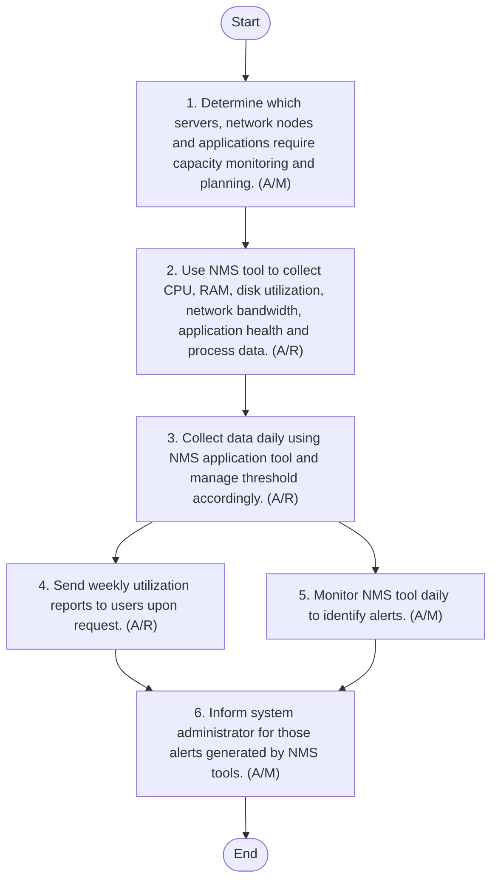

## Capacity Management

#### Purpose
The purpose of this procedure is to establish a structured approach for managing the capacity of critical IT resources within Arabian Mills. By monitoring and projecting capacity needs, the organisation aims to ensure optimal performance, prevent resource bottlenecks, and support future growth.
#### Scope
This procedure applies to all critical servers, network devices, and applications within Arabian Mills that require capacity monitoring and management. It covers both on-premises and cloud-hosted environments, ensuring comprehensive oversight of IT infrastructure capacity.
#### Procedure Reference
This procedure refers to the Operational Security Guidelines of ARABIAN MILLS Information Security, ensuring alignment with overarching security policies and standards.
#### Objectives
The objectives of this procedure are to:
 Identify Critical Resources: Determine which servers, network devices, and applications require capacity monitoring and projection.
 Monitor Key Parameters: Use tools like PRTG to monitor parameters such as CPU, RAM, disk utilization, network bandwidth, and application load.
 Generate Reports: Collect and report capacity data regularly to asset owners and stakeholders for informed decision-making.
 Plan for Future Needs: Conduct regular capacity planning meetings to discuss projections and approve necessary actions.
#### Responsibility
It is the responsibility of the IT & Cybersecurity Manager to ensure the proper implementation of this procedure. The procedure shall be reviewed and updated as necessary or at least annually by the IT & Cybersecurity Manager.
#### Capacity Management Procedure
To effectively manage the capacity of critical IT resources, Arabian Mills has established a comprehensive procedure that ensures optimal performance and supports future growth. This procedure involves monitoring key parameters, generating regular reports, and planning for future capacity needs through structured meetings and discussions.

| S No. | Procedure description | Responsibility | Frequency |
| --- | --- | --- | --- |
| 1 | Identify Critical Resources: Determine which servers, network devices, and applications require capacity monitoring and projection. | Preparer: IT & Cybersecurity Manager | Annually |
| 2 | **Monitor Parameters: Use PRTG tool to monitor the below parameters :** • Peak Load CPU utilization : 75%-80% • Peak Load RAM utilization : 70%-85% • HDD Disk utilization : 80%-90% • Peal Load network bandwidth utilization : 70%-85% • Peak load application utilization : Application-specific metrics (e.g., response times, transaction rates, user sessions) • HDD utilization for storing security data logs : 75% - 85% of allocated log storage capacity . | Preparer: IT Server and Network Admin | Daily |
| 3 | Collect Information: Collect data daily using PRTG automated tool and configure sensors accordingly. | Preparer: IT Server and Network Admin | Daily |
| 4 | Generate Reports : Send weekly utilization reports to asset owners (system-generated). | Preparer: IT Server and Network Admin | Weekly |
| 5 | Monitor Alerts: Monitor PRTG tool daily to identify alerts. | Preparer: Helpdesk Engineer | Daily |
| 6 | Inform Alerts: Inform system administrator about alerts generated in PRTG tool. | Preparer: Helpdesk Engineer | Daily |
| 7 | Analyse Alerts: Analyse alerts, discuss technical issues, suggest remedial actions, and inform asset owners via email with alert report. | Preparer: IT Server and Network Admin | As needed |

**[Diagram — Visio-EMF→PNG]:**

**Process Name:** Capacity Management Procedure  

**Roles / Swimlanes:**
- IT & Cybersecurity Manager
- IT Server and Network Admin
- Helpdesk Engineer  

---

### Steps

| Step # | Role | Action | Decision/Next Step |
|--------|------|--------|--------------------|
| Start | IT & Cybersecurity Manager | Start | Next: Step 1 |
| 1 | IT & Cybersecurity Manager | Determine which servers, network nodes and applications require capacity monitoring and planning. (A/M) | Next: Step 2 |
| 2 | IT Server and Network Admin | Use NMS tool to collect CPU, RAM, disk utilization, network bandwidth, application health and process data. (A/R) | Next: Step 3 |
| 3 | IT Server and Network Admin | Collect data daily using NMS application tool and manage threshold accordingly. (A/R) | Next: Step 4 and Step 5 (in parallel paths) |
| 4 | IT Server and Network Admin | Send weekly utilization reports to users upon request. (A/R) | Next: Step 6 |
| 5 | Helpdesk Engineer | Monitor NMS tool daily to identify alerts. (A/M) | Next: Step 6 |
| 6 | IT Server and Network Admin | Inform system administrator for those alerts generated by NMS tools. (A/M) | Next: End |
| End | IT Server and Network Admin | End | — |

---

#### Strategic Capacity Planning and Asset Management
In addition to the core capacity management activities, Arabian Mills engages in strategic capacity planning and asset management to ensure long-term resource optimisation and effective utilisation. Quarterly capacity planning meetings are held, involving the Chief Finance Officer, IT Team, and IT & Cybersecurity Manager. During these meetings, capacity planning reports are reviewed, and future projections are discussed and approved. Minutes of these meetings are maintained for 2 years to ensure transparency and accountability.
Furthermore, asset management is a critical component of capacity planning. The System Administrator and Security Team are responsible for updating the Asset Identification & Classification (AIC) sheet and conducting risk assessments for new assets. This ensures that all new systems, equipment, and devices are accurately recorded and evaluated for potential risks, supporting informed decision-making, and enhancing the organisation's security posture.
#### Team Roles

| Role . | Responsibility |
| --- | --- |
| System Administrator | Monitor and report capacity utilization, configure monitoring tools, and update asset records. |
| Network Administrator | Assist with alert analysis and technical discussions. |
| Helpdesk Engineer | Monitor alerts and inform system administrators. |
| IT & Cybersecurity Manager | Oversee procedure implementation and review. |
| Chief Finance Officer | Participate in capacity planning meetings and approve projections. |