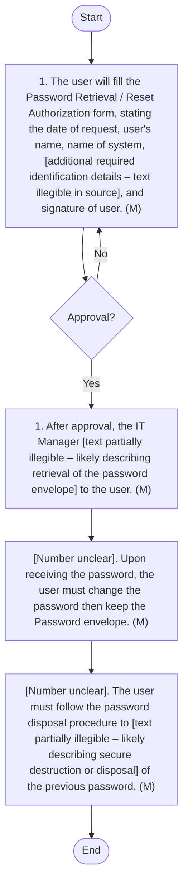

## Password Management

#### Purpose
The purpose of the Password Management Policy is to ensure the secure and effective management of passwords within Arabian Mills. This policy aims to protect sensitive information, enhance security, and ensure compliance with regulatory standards.
#### Scope
This policy applies to all user accounts, system admin accounts, and VPN user accounts managed by Arabian Mills.
#### Objectives
 Security: Protect passwords from unauthorized access and ensure they are strong and difficult to guess.
 Compliance: Ensure adherence to legal and regulatory standards for password management.
 Accountability: Define clear responsibilities for managing and maintaining password security.
#### Responsibility
The Cybersecurity Manager/IT & Cybersecurity Manager is responsible for the implementation and adherence to this policy. All users and administrators must follow the procedures outlined in this manual.
#### Password Standards
Administrator and System Admin Accounts
1. Password Complexity: Must contain upper & lower-case characters, numbers, and special characters.
2. Enforce Password History: 10 previous passwords.
3. Minimum Password Age: 1 day.
4. Maximum Password Age: 90 days (Administrator), 60 days (System Admin).
5. Minimum Password Length: 25 characters (Administrator), 14 characters (System Admin).
6. Maximum Password Length: 25 characters (Administrator), 14 characters (System Admin).
7. Failed Login Attempts: 3 (enabled).
8. Store Passwords Using Reversible Encryption: Disabled.
9. Account Lockout Threshold: 3.
10. Account Lockout Duration: 1 hour.
11. Reset Account Lockout Counter After: 30 minutes.
User Accounts
1. Password Complexity: Must contain upper & lower-case characters, numbers, and special characters.
2. Enforce Password History: 10 previous passwords.
3. Minimum Password Age: 1 day.
4. Maximum Password Age: 60 days.
5. Minimum Password Length: 12 characters.
6. Maximum Password Length: 14 characters.
7. Failed Login Attempts: 3 (enabled).
8. Store Passwords Using Reversible Encryption: Disabled.
9. Account Lockout Threshold: 3
10. Account Lockout Duration: 1 hour.
11. Reset Account Lockout Counter After: 30 minutes.
VPN User Accounts
1. Password Complexity: Must contain upper & lower-case characters, numbers, and special characters.
2. Minimum Password Age: 1 day.
3. Maximum Password Age: 60 days.
4. Minimum Password Length: 12 characters.
5. Maximum Password Length: 18 characters.
6. Account Idle Logout Duration: 5 minutes.
Password Revoke & Expiry
1. Passwords for employees or third-party users must be revoked, preferably on the last day of employment or contract.
2. For third-party VPN access or temporary access, the password expiry date must be set at the time of user ID creation.
#### Password Guidelines
Weak Password Characteristics
 Contains less than 8 characters.
 Is a word found in a dictionary (English or foreign).
 A dictionary word with some letters simply replaced by numbers (e.g., a1rplan3).
 Common usage words: Names of family, pets, friends, co-workers, birthdays, addresses, etc.
 Computer terms and names, commands, sites, companies, hardware, software.
 Birthdays and other personal information such as address and phone numbers.
 Word or number patterns like aaabbb, qwerty, 123321, etc.
 Any of the above spelled backwards or preceded/followed by a digit (e.g., secret1, 1secret).
Strong Password Characteristics
 Contains both upper and lower-case characters (e.g., a-z, A-Z).
 Includes digits and punctuation characters (e.g., 0-9, !@#$%^&*()_+| ~-= '{}[]:";'<>?,./).
 At least 14 alphanumeric characters long.
 Not a word in any language, slang, dialect, jargon, etc.
 Not based on personal information, names of family, etc.
 Passwords should never be written down or stored on the system. Create passwords that can be easily remembered using phrases or song titles.
#### Password Management Procedures
User and System Accounts Admin Accounts Procedure
The User and System Admin Accounts Procedure outlines the steps required to ensure secure password management practices for all users and system administrators within Arabian Mills. This procedure includes training, initial configuration, temporary password assignment, and adherence to password standards. It aims to enhance security, promote best practices, and ensure compliance with the organization's password policies.

| S No. | Procedure description | Responsibility | Frequency |
| --- | --- | --- | --- |
| 1 | Initial Password Configuration: Configure passwords for new joiners to require a change at the first login. | Preparer: IT Network and System Admin | As Needed |
| 2 | Vendor Passwords : Change or disable default vendor-provided passwords immediately upon installation. | Preparer: IT Network and System Admin | As Needed |
| 3 | Temporary Passwords: Assign complex temporary passwords to users when needed. | Preparer: IT Network and System Admin | As Needed |
| 4 | Password Standards Compliance: Adhere to the standards specified in Section Admin and User accounts of the Password Management Standard when creating and managing passwords. | Responsibility: All Users | Ongoing |
| 5 | Password Changes: Change passwords whenever confidentiality is suspected to be compromised. | Responsibility: All Users | As Needed |
| 6 | Automated Logon: Avoid using automated logon options such as "Remember Me" to prevent unauthorized access. | Responsibility: All Users | Ongoing |


**[Diagram — Visio-EMF→PNG]:**

**Process Name:** User and System Accounts Admin Procedure  

**Roles / Swimlanes:**
- IT Network and Server Administrator
- All Users  

### Steps

| Step # | Role                             | Action                                                                                                                                                                  | Decision/Next Step |
|--------|----------------------------------|-------------------------------------------------------------------------------------------------------------------------------------------------------------------------|--------------------|
| 1      | IT Network and Server Administrator | Configure passwords for new logons to require a change at the first log-in. (A&M 1e)                                                                                   | Go to Step 2       |
| 2      | IT Network and Server Administrator | Change or disable default vendor provided user account(s) on new system installations. (A&M 1f)                                                                        | Go to Step 3       |
| 3      | IT Network and Server Administrator | Assign temporary, anonymous accounts to users when needed. (A&M 1h)                                                                                                    | Go to Step 4       |
| 4      | All Users                        | Adhere to the standards outlined within this policy, and the Secure Password Management standard when creating and managing passwords.                                | Go to Step 5       |
| 5      | All Users                        | Change passwords whenever confidentiality is suspected to be compromised.                                                                                              | Go to Step 6       |
| 6      | All Users                        | Avoid using automated logon software that saves usernames and passwords to prevent unauthorized access.                                                                | End                |

### Flow (Mermaid)

```mermaid
graph TD

    A[Start] --> S1[1. Configure passwords for new logons to require a change at the first log-in. (A&M 1e)]
    S1 --> S2[2. Change or disable default vendor provided user account(s) on new system installations. (A&M 1f)]
    S2 --> S3[3. Assign temporary, anonymous accounts to users when needed. (A&M 1h)]
    S3 --> S4[4. Adhere to the standards outlined within this policy, and the Secure Password Management standard when creating and managing passwords.]
    S4 --> S5[5. Change passwords whenever confidentiality is suspected to be compromised.]
    S5 --> S6[6. Avoid using automated logon software that saves usernames and passwords to prevent unauthorized access.]
    S6 --> E[End]
```

Password Envelope Management Procedure
The Password Envelope Management Procedure defines the process for managing privileged account passwords for critical servers and applications. This includes identifying critical accounts, securely storing passwords in sealed envelopes, and retrieving them when necessary. The procedure ensures that privileged account passwords are managed securely, reducing the risk of unauthorized access, and maintaining the integrity of critical systems.
Password Deposit Procedure
The Password Deposit Procedure outlines the steps for securely creating and storing privileged account passwords for critical servers and applications within Arabian Mills. This procedure includes generating strong passwords, documenting them in the password envelope creation register, and securely storing them in sealed envelopes. It aims to protect privileged account passwords from unauthorized access and maintain the integrity of critical systems.

| S No. | Procedure description | Responsibility | Frequency |
| --- | --- | --- | --- |
| 1 | Identify Critical Accounts: IT & Cybersecurity Manager , Asset Owner, and Security Team must identify critical server and application privilege accounts that require secure password management. | Preparer: IT & Cybersecurity Manager , Asset Owner, Security Team | As Needed |
| 2 | Create Strong Password: Generate a strong password following the guidelines specified in the Password Guidelines section. | Preparer: Asset Owner | As Needed |
| 3 | Enclose Password in Envelope: Place the password in an envelope, seal it, and label it with the relevant details. | Preparer: Asset Owner | As Needed |
| 4 | Hand Over Sealed Envelope: Deliver the sealed envelope to the IT & Cybersecurity Manager for secure storage. | Preparer: Asset Owner | As Needed |
| 5 | Fill Password Envelope Creation Register: Document the details of the password, including server/desktop/network device/host name, type of device, owner of the password, date of change, next scheduled change, password changed by, custodian of the password envelope, and verified by. | Preparer: IT Network and Server Admin | As Needed |
| 6 | Store Envelopes in Secure Loc ation : The IT & Cybersecurity Manager must store the sealed envelopes in a secure, locked location to prevent unauthorized access. | Preparer: IT & Cybersecurity Manager | Ongoing |


**[Diagram — Visio-EMF→PNG]:**

**Process Name:** Password Envelope Deposit Procedure  

**Roles / Swimlanes:**

- IT & Cybersecurity Manager  
- Asset Owner  
- Security Team  
- IT Network and System Admin  

---

### Steps

| Step # | Role                     | Action                                                                                                                                                                                                                                       | Decision/Next Step                                                                                                   |
|--------|--------------------------|----------------------------------------------------------------------------------------------------------------------------------------------------------------------------------------------------------------------------------------------|----------------------------------------------------------------------------------------------------------------------|
| Start  | IT & Cybersecurity Manager | Start                                                                                                                                                                                                                                        | Flows to step **1** (IT & Cybersecurity Manager).                                                                    |
| 1      | IT & Cybersecurity Manager | IT Manager must identify all critical server and application unique user accounts and the privileged accounts that require password envelopes management. (A/M)                                                                           | Flows downward to step **1** (Asset Owner).                                                                          |
| 1      | Asset Owner              | Asset Owner must identify critical server and application unique user accounts and privileged accounts that require password management. (A/M)                                                                                            | Flows to step **2** (Asset Owner).                                                                                   |
| 2      | Asset Owner              | Generate a strong password following the guidelines defined in the Password Guideline section. (A/M)                                                                                                                                       | Flows to step **3** (Asset Owner).                                                                                   |
| 3      | Asset Owner              | Place the password in an envelope, seal it, and record details. (M)                                                                                                                                                                        | Flows to step **4** (Asset Owner).                                                                                   |
| 4      | Asset Owner              | Deliver the sealed envelope to the IT Manager for secure storage. (A/M)                                                                                                                                                                    | Flows upward to step **5** (IT & Cybersecurity Manager).                                                             |
| 5      | IT & Cybersecurity Manager | The IT Manager must store the sealed envelopes in a secure, locked location to prevent unauthorised access. (M)                                                                                                                            | Flows downward to step **6** (IT Network and System Admin); step **6** also receives a flow from step **1** (Security Team). |
| 1      | Security Team            | Security Owner must regularly update server and application unique user accounts and privileged accounts that require password management. (A/M)                                                                                          | Flows rightward then downward to join the flow into step **6** (IT Network and System Admin).                        |
| 6      | IT Network and System Admin | Document the details of the password, including server/application/network device name, type of account, date of password object changed, and where the password object is stored, on record of the password envelope, and verified by. (M) | Flows to **End**.                                                                                                    |
| End    | IT Network and System Admin | End                                                                                                                                                                                                                                          | —                                                                                                                    |

*There are no decision diamonds or Yes/No branches in this flow; all transitions are linear connections as described above.*

---

### Mermaid.js Diagram

```mermaid
graph TD

    %% Nodes
    Start([Start])

    IT1[1. IT Manager must identify all critical server and application unique user accounts and the privileged accounts that require password envelopes management. (A/M)]

    AO1[1. Asset Owner must identify critical server and application unique user accounts and privileged accounts that require password management. (A/M)]

    AO2[2. Generate a strong password following the guidelines defined in the Password Guideline section. (A/M)]

    AO3[3. Place the password in an envelope, seal it, and record details. (M)]

    AO4[4. Deliver the sealed envelope to the IT Manager for secure storage. (A/M)]

    IT5[5. The IT Manager must store the sealed envelopes in a secure, locked location to prevent unauthorised access. (M)]

    ST1[1. Security Owner must regularly update server and application unique user accounts and privileged accounts that require password management. (A/M)]

    ITN6[6. Document the details of the password, including server/application/network device name, type of account, date of password object changed, and where the password object is stored, on record of the password envelope, and verified by. (M)]

    End([End])

    %% Flows
    Start --> IT1
    IT1 --> AO1
    AO1 --> AO2
    AO2 --> AO3
    AO3 --> AO4
    AO4 --> IT5
    IT5 --> ITN6
    ST1 --> ITN6
    ITN6 --> End
```

Password Retrieval Procedure
The Password Deposit Procedure outlines the steps for securely creating and storing privileged account passwords for critical servers and applications within Arabian Mills. This procedure includes generating strong passwords, documenting them in the password envelope creation register, and securely storing them in sealed envelopes. It aims to protect privileged account passwords from unauthorized access and maintain the integrity of critical systems. Retrieval can be made only in the following scenarios:
1. Password forgotten by the user.
2. Needed by others in the absence of the asset owner.

| S No. | Procedure description | Responsibility | Frequency |
| --- | --- | --- | --- |
| 1 | Request Password Retrieval: In specific scenarios such as password forgotten or needed by others in the absence of the asset owner, the user must fill the Password Opening Register, documenting the date of opening, user, team, reason, date of replacement, signature of the user, and signature of password owner. | Preparer: User | As Needed |
| 2 | Approval: Obtain approval from the IT & Cybersecurity Manager for the password retrieval request, ensuring it is legitimate and authorized. | Reviewer: IT & Cybersecurity Manager | As Needed |
| 3 | Hand Over Envelope: After approval, the IT & Cybersecurity Manager provides the sealed envelope to the user. | Preparer: IT & Cybersecurity Manager | As Needed |
| 4 | Change Password : Upon retrieving the password, the user must change the password following the guidelines specified in Section 5.2. | Preparer: User | As Needed |
| 5 | Follow Password Deposit Procedure : The user must follow the password deposit procedure to securely store the new password. | Preparer: User; | As Needed |


**[Diagram — Visio-EMF→PNG]:**

**Process Name:** Password Retrieval Procedure  

**Roles / Swimlanes:**

- User  
- IT & Cybersecurity Manager  

---

### Steps

| Step # | Role                     | Action | Decision/Next Step |
|--------|--------------------------|--------|--------------------|
| 1 | User | **Start** | Proceed to Step 2. |
| 2 | User | **“1. The user will fill the Password Retrieval / Reset Authorization form, stating the date of request, user's name, name of system, [additional required identification details – text illegible in source], and signature of user. (M)”** | Form goes to IT & Cybersecurity Manager for approval (Step 3). |
| 3 | IT & Cybersecurity Manager | **Decision: “Approval?”** | **Yes:** Proceed to Step 4.  **No:** Return to Step 2 (User re‑submission / correction of the Password Retrieval / Reset Authorization form). |
| 4 | IT & Cybersecurity Manager | **“1. After approval, the IT Manager [text partially illegible – likely describing retrieval of the password envelope] to the user. (M)”** | Proceed to Step 5. |
| 5 | User | **“[Number unclear]. Upon receiving the password, the user must change the password then keep the Password envelope. (M)”** | Proceed to Step 6. |
| 6 | User | **“[Number unclear]. The user must follow the password disposal procedure to [text partially illegible – likely describing secure destruction or disposal] of the previous password. (M)”** | Proceed to Step 7. |
| 7 | User | **End** | Process terminates. |

---



Password Revocation Procedure
The Password Revocation Procedure is designed to ensure the timely and secure revocation of passwords for employees and third-party users upon termination of employment, contract expiration, or when access is no longer required. This procedure aims to prevent unauthorized access, protect sensitive information, and maintain the integrity of the organization's IT systems.

| S No. | Procedure description | Responsibility | Frequency |
| --- | --- | --- | --- |
| 1 | Identify Accounts for Revocation : Regularly review user accounts to identify those that require password revocation due to employment termination, contract expiration, or other reasons. | Preparer: IT Network and Server Admin | Monthly |
| 2 | Initiate Revocation : Upon identification, initiate the password revocation process for the relevant accounts. | Preparer: IT Network and Server Admin | As Needed |
| 3 | Approval: Obtain approval from the IT & Cybersecurity Manager before proceeding with password revocation. | Reviewer: IT & Cybersecurity Manager | As Needed |
| 4 | Revoke Passwords: Disable or change passwords for identified accounts, ensuring that access is effectively revoked. | Preparer: IT Network and Server Admin | As Needed |
| 5 | Update Access Control Lists: Ensure that access control lists and permissions are updated to reflect the revocation, preventing any unauthorized access. | Preparer: IT Network and Server Admin | As Needed |
| 6 | Document Revocation : Record the details of the password revocation in the appropriate register, including account information, date of revocation, reason for revocation, and actions taken. | Preparer: IT Network and Server Admin | As Needed |


**[Diagram — Visio-EMF→PNG]:**

**Process Name:** Password Revocation Procedure  

**Roles / Swimlanes:**
- IT Network and Server Admin
- IT & Cybersecurity Manager  

---

### Steps

| Step # | Role                     | Action | Decision/Next Step |
|--------|--------------------------|--------|--------------------|
| Start  | IT Network and Server Admin | Start | Proceed to Step 1 |
| 1 | IT Network and Server Admin | Review user accounts Monthly to identify those that require password revocation due to resignation, termination, role changes, or other reasons. (IAM) | Proceed to Step 2 |
| 2 | IT Network and Server Admin | Upon identification, initiate the password revocation process for the relevant accounts. (IAM) | Proceed to Step 3 (decision by IT & Cybersecurity Manager) |
| 3 | IT & Cybersecurity Manager | Approve? | **Yes** → Proceed to Step 4. **No** → Return to Step 2 (IT Network and Server Admin revises/does not proceed with the initiated revocation). |
| 4 | IT Network and Server Admin | Disable or change passwords for all identified user accounts in all relevant systems, ensuring that access is effectively revoked. (IAM) | Proceed to Step 5 |
| 5 | IT Network and Server Admin | Ensure that access control lists and other permissions settings are updated to reflect the revocation, preventing any unauthorized access. (IAM) | Proceed to Step 6 |
| 6 | IT Network and Server Admin | Record the details of the password revocation in the appropriate logs, including the user information, date of revocation, reason for revocation, and actions taken. (M) | Proceed to End |
| End | IT Network and Server Admin | End | — |

---

### Branch Tracing

- From Step 3 “Approve?”:
  - **Yes**: flow goes to Step 4.
  - **No**: flow returns to Step 2 for the IT Network and Server Admin (revocation not carried out / needs revision).

---

```mermaid
graph TD

    Start([Start])
    S1[1. Review user accounts Monthly to identify those that require password revocation due to resignation, termination, role changes, or other reasons. (IAM)]
    S2[2. Upon identification, initiate the password revocation process for the relevant accounts. (IAM)]
    D3{3. Approve?}
    S4[4. Disable or change passwords for all identified user accounts in all relevant systems, ensuring that access is effectively revoked. (IAM)]
    S5[5. Ensure that access control lists and other permissions settings are updated to reflect the revocation, preventing any unauthorized access. (IAM)]
    S6[6. Record the details of the password revocation in the appropriate logs, including the user information, date of revocation, reason for revocation, and actions taken. (M)]
    End([End])

    Start --> S1 --> S2 --> D3
    D3 -->|Yes| S4 --> S5 --> S6 --> End
    D3 -->|No| S2
```