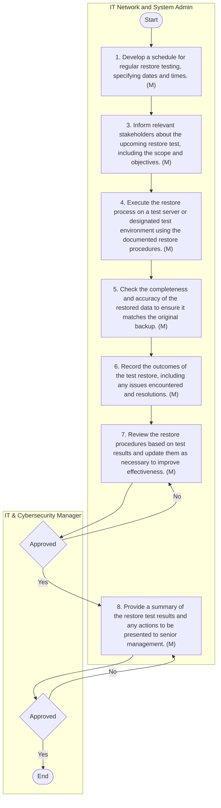

## Backup and Restore

#### Purpose
The purpose of this document is to establish a systematic approach for the backup and restoration of critical data and applications within Arabian Mills. This procedure ensures that data integrity and availability are maintained, minimising the risk of data loss due to system failures, human errors, or unforeseen events. By implementing a structured backup and restore process, Arabian Mills aims to safeguard business-critical information, support business continuity, and facilitate prompt recovery from disruptions.
#### Scope
This procedure applies to all critical servers hosting applications and data used within Arabian Mills, managed by the IT department. It encompasses local servers, SAP servers, and any other systems deemed essential for operational continuity. The scope includes regular backups, monitoring of backup processes, and restoration activities to ensure data accessibility and reliability.
#### Procedure Reference
This procedure refers to the Backup and Recovery Management Procedure of Arabian Mills Information Security, which outlines the overarching framework and policies governing data protection and recovery efforts within the organisation.
#### Objectives
 Ensure Data Integrity: Protect critical data from loss or corruption, ensuring its accuracy and reliability.
 Maintain Data Availability: Guarantee that essential data is readily accessible for operational needs and recovery processes.
 Support Business Continuity: Facilitate uninterrupted business operations by enabling swift data recovery in the event of disruptions.
 Minimise Downtime: Reduce the time required to restore data and applications, thereby minimising operational impacts.
 Enhance Security: Implement secure backup processes to protect data from unauthorised access and breaches.
#### Backup Procedures
The Backup Procedure is designed to protect critical data by systematically copying and storing information from local and SAP servers. This ensures data integrity and availability in case of system failures, human errors, or unforeseen events.
#### Local Server Backup Procedure
The Local Servers Backup Procedure focuses on ensuring the safety and reliability of data stored on local servers. By implementing scheduled backups and log checks, Arabian Mills aims to prevent data loss and facilitate efficient recovery.

| S No. | Procedure description | Responsibility | Frequency |
| --- | --- | --- | --- |
| 1 | Identify Business-Critical Servers: Determine which servers and application data need to be backed up. | Preparer: IT Network and System Admin | As needed |
| 2 | Select Backup Type and Frequency : Choose between Incremental, Full, or Snapshot backups for selected servers/application data. | Preparer: IT Network and System Admin | As needed |
| 3 | Configure Veeam Backup Application: Set up backups on Dell storage and offline storage according to the schedule in the backup form. | Preparer: IT Network and System Admin | As needed |
| 4 | Daily Offline Storage Backup: Schedule backups to run daily at 8 am on Synology storage. | Preparer: IT Network and System Admin | Daily at 8 am |
| 5 | Daily Log Check: Review backup logs daily at 10:00 am for the previous day's backups. | Preparer: IT Network and System Admin | Daily at 10 am |
| 6 | Backup Failure Management: Analyse logs and reinitiate backup if failures occur. If the same backup job fails for three consecutive days, inform the IT & Cybersecurity Manager , and initiate the Incident Management Procedure. | Preparer: IT Network and System Admin | As neede d |


**[Diagram — Visio-EMF→PNG]:**

**Process Name:** Local Servers Backup Procedure  

**Roles / Swimlanes:**
- IT Network and System Admin  

| Step # | Role | Action (verbatim where legible; `[illegible]` where text cannot be read) | Decision/Next Step |
|--------|------|---------------------------------------------|--------------------|
| Start | IT Network and System Admin | Start | Proceed to Step 1 |
| 1 | IT Network and System Admin | 1. Determine which servers and application data need to be backed up. (M) | Proceed to Step 2 |
| 2 | IT Network and System Admin | 2. Choose between Incremental, Full, or Differential backup for selected servers / application data. (M) | Proceed to Step 3 |
| 3 | IT Network and System Admin | 3. Set up backups on Dell [illegible] [additional text not legible] according to the schedule in the backup form. (M) | Proceed to Step 4 |
| 4 | IT Network and System Admin | 4. Schedule backups to run daily at 10:00 pm to [illegible] storage. (M) | Proceed to Step 5 |
| 5 | IT Network and System Admin | 5. Review backup logs daily at 8:00 am on the previous day's backups. (M) | Proceed to Step 6 |
| 6 | IT Network and System Admin | 6. Analyze logs and validate/notate backup status as one of the following: [illegible list]. If [illegible condition] refer to the [illegible] Incident Management Procedure. (M) | Proceed to End |
| End | IT Network and System Admin | End | — |

**Yes/No Branches:**
- No explicit Yes/No decision diamonds or branches are depicted in the diagram. Any conditional logic appears only as text within Step 6 and is not represented as a separate decision node.

```mermaid
graph TD

    Start([Start])
    S1[1. Determine which servers and application data need to be backed up. (M)]
    S2[2. Choose between Incremental, Full, or Differential backup for selected servers / application data. (M)]
    S3[3. Set up backups on Dell [illegible] ... according to the schedule in the backup form. (M)]
    S4[4. Schedule backups to run daily at 10:00 pm to [illegible] storage. (M)]
    S5[5. Review backup logs daily at 8:00 am on the previous day's backups. (M)]
    S6[6. Analyze logs and validate/notate backup status as one of the following: [illegible]. If [illegible] refer to the [illegible] Incident Management Procedure. (M)]
    End([End])

    Start --> S1 --> S2 --> S3 --> S4 --> S5 --> S6 --> End
```

#### SAP Server Backup Procedure
The SAP Servers Backup Procedure focuses on safeguarding critical SAP server data using systematic backup schedules and technologies. This ensures the reliability and accessibility of SAP applications and databases.

| S No. | Procedure description | Responsibility | Frequency |
| --- | --- | --- | --- |
| 1 | Identify Critical SAP Servers: Determine which SAP servers and application data need to be backed up. | Preparer: IT Network and System Admin | As needed |
| 2 | Select Backup Type and Frequency: Choose between Incremental, Full, or Snapshot backups for selected SAP servers/application data. | Preparer: IT Network and System Admin | As needed |
| 3 | Configure Commvault Backup Application: Set up backups on Fujitsu storage and Tape Library storage according to the schedule in the backup and restore form. | Preparer: IT Network and System Admin | As needed |
| 4 | Daily Log Check: Review backup logs daily at 10:00 am for the previous day's backups. | Preparer: IT Network and System Admin | Daily at 10 am |
| 5 | Backup Failure Management: Analyse logs and reinitiate backup or contact Fujitsu support for resolving issues. If the same backup job fails for two consecutive schedules, inform the IT & Cybersecurity Manager , and initiate the Incident Management Procedure. | Preparer: IT Network and System Admin | As needed |


**[Diagram — Visio-EMF→PNG]:**

**Process Name:** SAP Servers Backup Procedure  

**Roles / Swimlanes:**

- IT Network and System Admin

---

### Steps

| Step # | Role                     | Action | Decision / Next Step |
|--------|--------------------------|--------|----------------------|
| Start  | IT Network and System Admin | Start | Proceed to Step 1 |
| 1      | IT Network and System Admin | Determine which SAP servers and application data will be backed up. (M) | Proceed to Step 2 |
| 2      | IT Network and System Admin | Co-ordinate between Network, SAP & schedule backups for selected SAP servers/application data. (M) | Proceed to Step 3 |
| 3      | IT Network and System Admin | Set up backups on off-peak usage and tape or disk storage to be stored at the remote site and used for restore. (M) | Proceed to Step 4 |
| 4      | IT Network and System Admin | Review backup logs daily at 10:00 am from backup tool. (M) | Proceed to Step 5 |
| 5      | IT Network and System Admin | Analyze logs and maintain logs for monitoring failed backup or recurring failure. If there are backup logs of unresolved failures, then raise ticket according to the Incident Management Procedure. (M) | Proceed to End |
| End    | IT Network and System Admin | End | — |

There are no Yes/No or branching decision points in this flow; the process is fully linear from Start to End.

---

```mermaid
graph TD
    A[Start]
    B[1. Determine which SAP servers and application data will be backed up. (M)]
    C[2. Co-ordinate between Network, SAP & schedule backups for selected SAP servers/application data. (M)]
    D[3. Set up backups on off-peak usage and tape or disk storage to be stored at the remote site and used for restore. (M)]
    E[4. Review backup logs daily at 10:00 am from backup tool. (M)]
    F[5. Analyze logs and maintain logs for monitoring failed backup or recurring failure. If there are backup logs of unresolved failures, then raise ticket according to the Incident Management Procedure. (M)]
    G[End]

    A --> B --> C --> D --> E --> F --> G
```

#### Restoration Procedure
The Restoration Procedure outlines the steps for recovering data from backups, ensuring that business operations can resume swiftly and efficiently after disruptions. This process includes verification and management of restoration activities.

| S No. | Procedure description | Responsibility | Frequency |
| --- | --- | --- | --- |
| 1 | Identify Restoration Needs: Determine which server/application/data needs restoration. Complete the Restore Form. | Preparer: IT Network and System Admin | As needed |
| 2 | Approval of Restore Form: Obtain necessary approvals for the restore request from the IT & Cybersecurity Manager . | Reviewer: IT & Cybersecurity Manager | As needed |
| 3 | Schedule Restore Activity: After final approval, plan the restoration process. | Preparer: IT Network and System Admin | As needed |
| 4 | Restore Data: Perform restoration on the test server or path provided by the user. | Preparer: IT Network and System Admin | As needed |
| 5 | Verify Restored Data: Check the completeness and accuracy of restored data. | Preparer: IT Network and System Admin | As needed |
| 6 | Successful Restoration Notification: Email IT & Cybersecurity Manager upon successful restoration test. | Preparer: IT Network and System Admin | As needed |
| 7 | Restoration Failure Management: Initiate the Incident Management Procedure, conduct root cause analysis, and re-test if restoration fails. | Preparer: IT Network and System Admin | As needed |

Notes:
 Restoration must be conducted every six months on a Last in First Out (LIFO) basis.
 Backup Administrator must maintain the Mean Time Before Failure (MTBF) for all storage drives/tapes used in the process.

**[Diagram — Visio-EMF→PNG]:**

**Process Name:** Restoration Procedure  

**Roles / Swimlanes:**

- IT Network and System Admin  
- IT & Cybersecurity Manager  

### Steps

| Step # | Role / Swimlane              | Action (exact text from diagram)                                                                                                                                      | Decision / Next Step (as shown in diagram)                                                                                                                                         |
|--------|------------------------------|----------------------------------------------------------------------------------------------------------------------------------------------------------------------|------------------------------------------------------------------------------------------------------------------------------------------------------------------------------------|
| Start  | IT Network and System Admin  | Start                                                                                                                                                                 | Downward arrow to step **1**.                                                                                                                                                      |
| 1      | IT Network and System Admin  | 1. Determine which server / application requires restoration. Complete the Restore Form.(M)                                                                          | Downward arrow to decision **Approved** in the IT & Cybersecurity Manager swimlane.                                                                                               |
| Approved (decision) | IT & Cybersecurity Manager | Approved                                                                                                                                                              | Arrow labeled **Yes** from this diamond to step **2**. (No explicit “No” branch is attached directly to this diamond in the visible portion of the diagram.)                      |
| 2      | IT Network and System Admin  | 2.After final approval, plan the restoration process.(M)                                                                                                             | Downward arrow to step **4**.                                                                                                                                                      |
| 4      | IT Network and System Admin  | 4.Perform restoration on the test server or patch provided by the user.(M)                                                                                           | Rightward arrow to step **5**.                                                                                                                                                     |
| 5      | IT Network and System Admin  | 5.Check the completeness and accuracy of restored data.(M)                                                                                                           | Rightward arrow to step **7**.  Downward arrow to step **6**.  A separate long horizontal arrow labeled **No** runs from the area beneath this step back to the **Approved** diamond. |
| 6      | IT & Cybersecurity Manager   | 6.Email IT Manager upon successful restoration task.(M)                                                                                                              | Upward/rightward arrow from this step to **End**.                                                                                                                                  |
| 7      | IT Network and System Admin  | 7.Relate the Incident Management Procedure, if data can not be successfully restored. IT admin to create an incident ticket.(M)                                      | Arrow from this step to **End**.                                                                                                                                                   |
| End    | (at right end of flow)       | End                                                                                                                                                                   | Terminal point of the process.                                                                                                                                                     |

> Note: The numbering in the original diagram jumps from step 2 to step 4; there is no step labeled “3.” All parenthetical “(M)” markings are included exactly as shown.

---

### Mermaid.js representation

```mermaid
graph TD

  Start([Start])

  S1[1. Determine which server / application requires restoration. Complete the Restore Form.(M)]

  DApproved{Approved}

  S2[2.After final approval, plan the restoration process.(M)]

  S4[4.Perform restoration on the test server or patch provided by the user.(M)]

  S5[5.Check the completeness and accuracy of restored data.(M)]

  S6[6.Email IT Manager upon successful restoration task.(M)]

  S7[7.Relate the Incident Management Procedure, if data can not be successfully restored. IT admin to create an incident ticket.(M)]

  End([End])

  %% Main flow
  Start --> S1 --> DApproved
  DApproved -- Yes --> S2 --> S4 --> S5
  S5 --> S7 --> End
  S5 --> S6 --> End

  %% Loop-back shown with "No" label
  S5 -. No .-> DApproved
```

#### Restore Testing Procedure
This procedure ensures regular testing of restore processes to verify the effectiveness of backup systems. Regular restore testing helps identify and resolve issues before they become critical, ensuring reliable data recovery during actual incidents.

| S No. | Procedure description | Responsibility | Frequency |
| --- | --- | --- | --- |
| 1 | Plan Restore Testing Schedule: Develop a schedule for regular restore testing, specifying dates and times. | Preparer: IT Network and System Admin | Quarterly |
| 2 | Approve Testing Schedule: Obtain approval for the restore testing schedule from the IT & Cybersecurity Manager . | Reviewer: IT & Cybersecurity Manager | Quarterly |
| 3 | Notify Stakeholders: Inform relevant stakeholders about the upcoming restore test, including the scope and objectives. | Preparer: IT Network and System Admin | Before each scheduled test |
| 4 | Perform Test Restore: Execute the restore process on a test server or designated path, following the documented restore procedures. | Preparer: IT Network and System Admin | Quarterly |
| 5 | Verify Restored Data: Check the completeness and accuracy of the restored data to ensure it matches the original backup. | Preparer: IT Network and System Admin | Quarterly |
| 6 | Document Test Results: Record the outcomes of the test restore, including any issues encountered and resolutions. | Preparer: IT Network and System Admin | After each test |
| 7 | Review and Update Procedures: Review the restore procedures based on test results and update them as necessary to improve effectiveness. | Preparer: IT Network and System Admin | After each test |
| 8 | Approve Updated Procedures: Obtain approval for any updates to the restore procedures from the IT & Cybersecurity Manager . | Reviewer: IT & Cybersecurity Manager | After each test |
| 9 | Report to Management: Provide a summary of the restore test results and any updates to procedures to senior management. | Preparer: IT & Cybersecurity Manager | After each test |


**[Diagram — Visio-EMF→PNG]:**

**Process Name:** Restore Testing Procedure  

**Roles / Swimlanes:**

- IT Network and System Admin  
- IT & Cybersecurity Manager  

### Steps

| Step # | Role | Action | Decision / Next Step |
| --- | --- | --- | --- |
| 0 | IT Network and System Admin | **Start** | Proceed to Step 1. |
| 1 | IT Network and System Admin | **1. Develop a schedule for regular restore testing, specifying dates and times. (M)** | Proceed to Step 2. |
| 2 | IT Network and System Admin | **3. Inform relevant stakeholders about the upcoming restore test, including the scope and objectives. (M)** | Proceed to Step 3. |
| 3 | IT Network and System Admin | **4. Execute the restore process on a test server or designated test environment using the documented restore procedures. (M)** | Proceed to Step 4. |
| 4 | IT Network and System Admin | **5. Check the completeness and accuracy of the restored data to ensure it matches the original backup. (M)** | Proceed to Step 5. |
| 5 | IT Network and System Admin | **6. Record the outcomes of the test restore, including any issues encountered and resolutions. (M)** | Proceed to Step 6. |
| 6 | IT Network and System Admin | **7. Review the restore procedures based on test results and update them as necessary to improve effectiveness. (M)** | Proceed to Step 7 (Decision 1). |
| 7 | IT & Cybersecurity Manager | **Decision 1: Approved** | **Yes:** Proceed to Step 8.  **No:** Loop back to Step 6 to further review and update the restore procedures. |
| 8 | IT Network and System Admin | **8. Provide a summary of the restore test results and any actions to be presented to senior management. (M)** | Proceed to Step 9 (Decision 2). |
| 9 | IT & Cybersecurity Manager | **Decision 2: Approved** | **Yes:** Proceed to Step 10 (End).  **No:** Loop back to Step 8 to revise the summary of restore test results and actions. |
| 10 | IT & Cybersecurity Manager | **End** | Process terminates. |

### Mermaid.js representation



#### Backup Integrity Verification Procedure
This procedure ensures regular verification and testing of backups to maintain data integrity. Regular verification helps identify and address issues with backups before they become critical, ensuring reliable data recovery.

| S No. | Procedure description | Responsibility | Frequency |
| --- | --- | --- | --- |
| 1 | Plan Verification Schedule: Develop a schedule for regular verification of backup integrity, specifying dates and times. | Preparer: IT Network and System Admin | Weekly |
| 2 | Approve Verification Schedule: Obtain approval for the verification schedule from the IT & Cybersecurity Manager . | Reviewer: IT & Cybersecurity Manager | Weekly |
| 3 | Notify Stakeholders: Inform relevant stakeholders about the upcoming verification process, including the scope and objectives. | Preparer: IT Network and System Admin | Before each scheduled verification |
| 4 | Verify Backup Completeness: Review backup logs and metadata to ensure all critical data is included in the backups. | Preparer: IT Network and System Admin | Weekly |
| 5 | Verify Backup Accuracy: Check the integrity of the backed-up data to ensure it is accurate and not corrupted. | Preparer: IT Network and System Admin | Weekly |
| 6 | Perform Test Restores: Execute test restores on a sample of backups to verify their functionality and reliability. | Preparer: IT Network and System Admin | Monthly |
| 7 | Document Verification Results: Record the outcomes of the verification process, including any issues encountered and resolutions. | Preparer: IT Network and System Admin | After each verification |
| 8 | Review and Update Procedures: Review the backup procedures based on verification results and update them as necessary to improve effectiveness. | Preparer: IT Network and System Admin | After each verification |
| 9 | Approve Updated Procedures: Obtain approval for any updates to the backup procedures from the IT & Cybersecurity Manager . | Reviewer: IT & Cybersecurity Manager | After each verification |
| 10 | Report to Management: Provide a summary of the verification results and any updates to procedures to senior management. | Preparer: IT & Cybersecurity Manager | After each verification |


**[Diagram — Visio-EMF→PNG]:**


#### Annexure

**[Diagram — Visio-EMF→PNG]:**

Backup and Restore  
Annexure.pdf