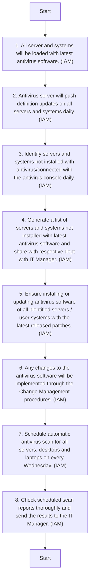

## Antivirus and Patch Management

#### Purpose
The purpose of this procedure is to establish effective antivirus and patch management practices within Arabian Mills. By ensuring timely updates and proactive monitoring, the organisation aims to protect its IT infrastructure from malware threats and vulnerabilities, maintaining system integrity and performance.
#### Scope
This procedure applies to all servers, desktops, laptops, and network devices within Arabian Mills' IT infrastructure. It covers the installation, update, and monitoring of antivirus software, as well as patch management for operating systems, applications, and network devices.
#### Procedure Reference
This procedure refers to the Malware Management Guidelines and Vulnerability & Patch Management Guidelines of ARABIAN MILLS Information Security, ensuring alignment with overarching security policies and standards.
#### Objectives
The objectives of this procedure are to:
 Ensure Antivirus Protection: Install antivirus software on all servers and systems, ensuring regular updates and scans to detect and mitigate malware threats.
 Implement Patch Management: Regularly scan and apply patches to servers, applications, desktops, and network devices, addressing vulnerabilities and maintaining system security.
 Monitor and Report: Continuously monitor antivirus and patch management activities, generating reports for stakeholders to support informed decision-making.
#### Responsibility
It is the responsibility of the IT & Cybersecurity Manager to ensure the proper implementation of this procedure. The procedure shall be reviewed and updated as necessary or at least annually by the IT & Cybersecurity Manager.
#### Procedure for Antivirus Management
To protect Arabian Mills' IT infrastructure from malware threats, antivirus software must be installed, updated, and monitored regularly. The following table outlines the activities and responsibilities involved in antivirus management:

| S No. | Procedure description | Responsibility | Frequency |
| --- | --- | --- | --- |
| 1 | Install Antivirus: All server and systems installed with Bitdefender Antivirus. | Preparer: IT Network and System Admin | Initial setup |
| 2 | Update Definitions: Antivirus server push definition updates to all servers and systems daily. | Preparer: IT Netw ork and System Admin | Daily |
| 3 | Identify Unprotected Systems: Identify servers and systems not installed with antivirus or updated with the latest definition file daily. | Preparer: IT Network and System Admin | Daily |
| 4 | Generate Monthly Report: Generate a list of servers and systems not installed with the latest antivirus software and updates monthly, sharing the report with IT & Cybersecurity Manager . | Preparer: IT Network and System Admin | Monthly |
| 5 | Prevent Uninstallation: Ensure uninstalling or disabling antivirus software is disabled. Antivirus is password protected. | Preparer: IT Network and System Admin | Ongoing |
| 6 | Change Management: Any changes to the antivirus server is implemented through the change management procedure. | Preparer: IT Network and System Admin | As needed |
| 7 | Schedule Scans: Schedule automatic antivirus scans for all servers, desktops, and laptops every Wednesday. | Preparer: IT Network and System Admin | Weekly |
| 8 | Review Scan Results: Check schedule scan results every Thursday and send the results to the IT & Cybersecurity Manager . | Preparer: IT Network and System Admin | Weekly |


**[Diagram — Visio-EMF→PNG]:**

**Process Name:** Antivirus Management Procedure  

**Roles / Swimlanes:**
- IT Network and Server Admin
- IAM (individual executing the actions, as referenced in each step)

---

### Steps

| Step # | Role | Action (exact wording from diagram) | Decision/Next Step |
|--------|------|--------------------------------------|--------------------|
| 0 | IT Network and Server Admin / IAM | Start | Proceeds to Step 1. |
| 1 | IT Network and Server Admin / IAM | 1. All server and systems will be loaded with latest antivirus software. (IAM) | No decision; proceeds to Step 2. |
| 2 | IT Network and Server Admin / IAM | 2. Antivirus server will push definition updates on all servers and systems daily. (IAM) | No decision; proceeds to Step 3. |
| 3 | IT Network and Server Admin / IAM | 3. Identify servers and systems not installed with antivirus/connected with the antivirus console daily. (IAM) | No decision; proceeds to Step 4. |
| 4 | IT Network and Server Admin / IAM | 4. Generate a list of servers and systems not installed with latest antivirus software and share with respective dept with IT Manager. (IAM) | No decision; proceeds to Step 5. |
| 5 | IT Network and Server Admin / IAM | 5. Ensure installing or updating antivirus software of all identified servers / user systems with the latest released patches. (IAM) | No decision; proceeds to Step 6. |
| 6 | IT Network and Server Admin / IAM | 6. Any changes to the antivirus software will be implemented through the Change Management procedures. (IAM) | No decision; proceeds to Step 7. |
| 7 | IT Network and Server Admin / IAM | 7. Schedule automatic antivirus scan for all servers, desktops and laptops on every Wednesday. (IAM) | No decision; proceeds to Step 8. |
| 8 | IT Network and Server Admin / IAM | 8. Check scheduled scan reports thoroughly and send the results to the IT Manager. (IAM) | No decision; proceeds to Step 9. |
| 9 | IT Network and Server Admin / IAM | Start | End of the documented flow; no further steps indicated. |

There are no Yes/No or conditional branches; the process is entirely linear.

---



#### Procedure for Patch Management (Servers, Applications and Desktops)
Effective patch management is crucial for maintaining system security and performance. The following table details the activities and responsibilities for patch management on servers, applications, and desktops:

| S No. | Procedure description | Responsibility | Frequency |
| --- | --- | --- | --- |
| 1 | Implement Patch Management: Central Bitdefender patch management servers is implemented for servers, desktops, and laptops connected to the Arabian Mills IT network. | Preparer: IT Network and System Admin | Initial setup |
| 2 | Schedule Scanning: Scanning for missing patches is scheduled for every Wednesday. | Preparer: IT Network and System Admin | Weekly |
| 3 | Push Patches: Patches for desktops and laptops is pushed automatically by the Bitdefender Patch management server. | Preparer: IT Network and System Admin | Weekly |
| 4 | Manual Installation: Windows and non-Windows operating system servers is installed with the latest patches manually, after proper testing and verifying successful backup. | Preparer: IT Network and System Admin | As needed |
| 5 | Change Management: Patches for servers OS and applications is installed manually, following proper approval and the change management process. | Preparer: IT Network and System Admin | As needed |
| 6 | Verify Patch Implementation: Verify successful implementation of patches for servers OS and applications after completion. | Preparer: IT Network and System Admin | As needed |
| 7 | Share Patch List: Share the list of installed patches on servers and applications with the IT & Cybersecurity Manager monthly. | Preparer: IT Network and System Admin | Monthly |
| 8 | Maintain Patch List: List of installed patches on servers and applications is maintained in MS Excel and retained for 5 years. | Preparer: IT Network and System Admin | Ongoing |


**[Diagram — Visio-EMF→PNG]:**

**Process Name:** Patch Management Procedure (Server, Application, Desktop)

**Swimlane / Role:**

- IT Network and Server Admin

---

### Steps

| Step # | Role | Action (verbatim from diagram; unreadable portions marked) | Decision / Next Step |
|--------|------|-------------------------------------------------------------|----------------------|
| Start | IT Network and Server Admin | **Start** | Proceeds to Step 1 |
| 1 | IT Network and Server Admin (A/M) | 1. Contact Bitdefender patch management server with credentials and **[illegible text]** IT network Admin (A/M) | Proceeds to Step 2 |
| 2 | IT Network and Server Admin (A) | 2. Scanning for missing patches to be scheduled for every Wednesday. (A) | Proceeds to Step 3 |
| 3 | IT Network and Server Admin (A) | 3. Patches for desktops and laptops will be pushed automatically by the Bitdefender patch management server. (A) | Proceeds to Step 4 |
| 4 | IT Network and Server Admin (M) | 4. Windows and non-Windows desktops or servers which are not **[illegible text]** will be patched manually whenever required after taking user's approval and keeping successful backup. (M) | Proceeds to Step 5 |
| 5 | IT Network and Server Admin (M) | 5. Patches for servers OS and applications will be installed manually, before rollout **[illegible text]** required patches, change request must be **[illegible text]** for the same. (M) | Proceeds to Step 6 |
| 6 | IT Network and Server Admin (A/M) | 6. Verify successful implementation of patches for servers and desktops after completion. (A/M) | Proceeds to Step 7 |
| 7 | IT Network and Server Admin (W) | 7. Share the list of installed patches on servers and desktops with IT Manager monthly. (W) | Proceeds to Step 8 |
| 8 | IT Network and Server Admin (W) | 8. List of installed patches on servers and desktops will be maintained in Excel and retained for 5 years. (W) | Proceeds to End |
| End | IT Network and Server Admin | **End** | Flow terminates |

There are no decision diamonds or Yes/No branches in the diagram; the process is purely sequential from Start to End.

---

```mermaid
graph TD

    Start([Start])

    S1[1. Contact Bitdefender patch management server with credentials and **[illegible text]** IT network Admin (A/M)]
    S2[2. Scanning for missing patches to be scheduled for every Wednesday. (A)]
    S3[3. Patches for desktops and laptops will be pushed automatically by the Bitdefender patch management server. (A)]
    S4[4. Windows and non-Windows desktops or servers which are not **[illegible text]** will be patched manually whenever required after taking user's approval and keeping successful backup. (M)]
    S5[5. Patches for servers OS and applications will be installed manually, before rollout **[illegible text]** required patches, change request must be **[illegible text]** for the same. (M)]
    S6[6. Verify successful implementation of patches for servers and desktops after completion. (A/M)]
    S7[7. Share the list of installed patches on servers and desktops with IT Manager monthly. (W)]
    S8[8. List of installed patches on servers and desktops will be maintained in Excel and retained for 5 years. (W)]

    End([End])

    Start --> S1 --> S2 --> S3 --> S4 --> S5 --> S6 --> S7 --> S8 --> End
```

#### Procedure for Patch Management (Network Devices)
Network devices are critical components of the IT infrastructure and must be regularly updated to address vulnerabilities. The following table outlines the activities and responsibilities for patch management on network devices.

| S No. | Procedure description | Responsibility | Frequency |
| --- | --- | --- | --- |
| 1 | Scan Network Devices: Firewall, wireless controllers, L3 core switches, and L2 switches is scanned monthly for missing patches, firmware upgrades, or vulnerabilities. | Preparer: IT Network and System Admin | Monthly |
| 2 | Schedule Scanning: Scanning is done between the 1st and 10th of every month using third-party tools. | Preparer: IT Network and System Admin | Monthly |
| 3 | Patch Scheduling: Patch and firmware upgrades is scheduled with proper approval and following the change management process. | Preparer: IT Network and System Admin | As needed |
| 4 | Backup Configuration: Ensure the latest configuration backup is available before scheduled activity. | Preparer: IT Network and System Admin | As needed |
| 5 | Implementation Timing: Implementation schedule is after office hours only. | Preparer: IT Network and System Admin | As needed |
| 6 | Share Patch List: Share the list of patches and firmware upgrades installed on network devices with the IT & Cybersecurity Manager quarterly. | Preparer: IT Network and System Admin | Quarterly |
| 7 | Maintain Patch List: List of installed patches and firmware upgrades for network devices is maintained in MS Excel and retained for 5 years. | Preparer: IT Network and System Admin | Ongoing |


**[Diagram — Visio-EMF→PNG]:**

**Process Name:** Patch Management Procedure (Network Devices)

**Roles / Swimlanes:**

- IT Network and Server Admin

---

### Steps

| Step # | Role                      | Action                                                                                                                                                                                                 | Decision / Next Step          |
|--------|---------------------------|--------------------------------------------------------------------------------------------------------------------------------------------------------------------------------------------------------|-------------------------------|
| 0      | IT Network and Server Admin | Start                                                                                                                                                                                                  | Next: Step 1                  |
| 1      | IT Network and Server Admin | Firewall, wireless access points, network switches and VPN devices will be scanned, actively for new patches, security upgrades or vulnerabilities. (A/M)                                             | Next: Step 2                  |
| 2      | IT Network and Server Admin | Scanning shall be done at least once in a quarter by using suitable third party tools. (A/M)                                                                                                         | Next: Step 3                  |
| 3      | IT Network and Server Admin | Patch and firmware upgrades will be released and applied without significant lag in tune with the global patch management process. (M)                                                               | Next: Step 4                  |
| 4      | IT Network and Server Admin | Ensure the latest configuration backups available are backed up safely. (A/M)                                                                                                                        | Next: Step 5                  |
| 5      | IT Network and Server Admin | Implementation schedule will be after office hours only. (A/M)                                                                                                                                       | Next: Step 6                  |
| 6      | IT Network and Server Admin | Share the list of patches released and components installed on network devices with the IT Manager or users. (M)                                                                                    | Next: Step 7                  |
| 7      | IT Network and Server Admin | List of installed patches and evidence copies for network devices will be maintained in LAN drive and retained for 5 years. (M)                                                                      | Next: Step 8 (End)            |
| 8      | IT Network and Server Admin | End                                                                                                                                                                                                    | Process ends                  |

---

```mermaid
graph TD

    Start([Start])
    S1[1. Firewall, wireless access points, network switches and VPN devices will be scanned, actively for new patches, security upgrades or vulnerabilities. (A/M)]
    S2[2. Scanning shall be done at least once in a quarter by using suitable third party tools. (A/M)]
    S3[3. Patch and firmware upgrades will be released and applied without significant lag in tune with the global patch management process. (M)]
    S4[4. Ensure the latest configuration backups available are backed up safely. (A/M)]
    S5[5. Implementation schedule will be after office hours only. (A/M)]
    S6[6. Share the list of patches released and components installed on network devices with the IT Manager or users. (M)]
    S7[7. List of installed patches and evidence copies for network devices will be maintained in LAN drive and retained for 5 years. (M)]
    End([End])

    Start --> S1 --> S2 --> S3 --> S4 --> S5 --> S6 --> S7 --> End
```

#### Patch Testing Procedure
To ensure the integrity and security of Arabian Mills' IT infrastructure, a comprehensive testing procedure for patches has been established. This procedure involves setting up a dedicated testing environment, defining clear testing criteria, and implementing rollback plans to address any issues that may arise during testing. The following table outlines the activities and responsibilities involved in the detailed testing process:

| S No. | Procedure description | Responsibility | Frequency |
| --- | --- | --- | --- |
| 1 | Establish Testing Environment: Set up a dedicated testing environment that mirrors the production environment as closely as possible, including representative servers, applications, desktops, and network devices. | Preparer: IT Network and System Admin | Initial setup and as needed |
| 2 | Define Testing Criteria: Specify clear criteria for successful testing of patches, including performance metrics, functionality checks, compatibility assessments, and security validations. | Preparer: IT Network and System Admin | Initial setup and review annually |
| 3 | Preparation: Back up current configurations and data before applying patches. | Preparer: IT Network and System Admin | Before each testing cycle |
| 4 | Installation: Apply the patch in the testing environment. | Preparer: IT Network and System Admin | During each testing cycle |
| 5 | Verification: Check system performance, functionality, and security post-patch. | Preparer: IT Network and System Admin | After patch installation |
| 6 | Monitoring: Observe the system for a predefined period to detect any issues. | Preparer: IT Network and System Admin | Post-patch installation |
| 7 | Rollback Preparation: Ensure backups are available and tested to revert patches if issues are identified during testing. | Preparer: IT Network and System Admin | Before each testing cycle |
| 8 | Rollback Execution: Steps to remove the patch and restore the system to its previous state if issues are identified. | Preparer: IT Network and System Admin | As needed |
| 9 | Rollback Verification: Confirm that the rollback was successful , and the system is functioning correctly. | Preparer: IT Network and System Admin | Post-rollback execution |
| 10 | Document Testing Results: Maintain detailed records of testing results, including any issues encountered and steps taken to resolve them. | Preparer: IT Network and System Admin | After each testing cycle |


**[Diagram — Visio-EMF→PNG]:**

**Process Name:** Patch Testing Procedure  

**Role / Swimlane:**

- IT Network and Server Admin

---

### Steps

| Step # | Role | Action | Decision/Next Step |
|--------|------|--------|--------------------|
| Start | IT Network and Server Admin | Start | Proceed to Step 1 |
| 1 | IT Network and Server Admin | Set up a standard testing environment that mirrors production environment as closely as possible. (NA) | Next: Step 2 |
| 2 | IT Network and Server Admin | Specify clear criteria for successful/critical patch(es). (NA) | Next: Step 3 |
| 3 | IT Network and Server Admin | Back up current configuration settings as baseline options before applying patches. (NA) | Next: Step 4 |
| 4 | IT Network and Server Admin | Apply the patch in the testing environment. (NA) | Next: Step 5 |
| 5 | IT Network and Server Admin | Check system performance, functionality, and security after patch. (NA) | Next: Step 6 |
| 6 | IT Network and Server Admin | Observe the system for a period of time to detect potential issues. (NA) | Next: Step 7 |
| 7 | IT Network and Server Admin | Ensure backups are available and test to verify patch or hot fixes are tested through testing environment. (NA) | Next: Step 8 |
| 8 | IT Network and Server Admin | Scan for/remove the patch and restore the system to previous state if issues are detected. (NA) | Next: Step 9 |
| 9 | IT Network and Server Admin | Apply the patch in the testing environment. (NA) | Next: End |
| End | IT Network and Server Admin | End | — |

*(Note: Some small-print words are slightly unclear in the image; the above text reflects them as closely as possible without omission.)*

---

```mermaid
graph TD

    Start([Start])

    S1[1. Set up a standard testing environment that mirrors production environment as closely as possible. (NA)]
    S2[2. Specify clear criteria for successful/critical patch(es). (NA)]
    S3[3. Back up current configuration settings as baseline options before applying patches. (NA)]
    S4[4. Apply the patch in the testing environment. (NA)]
    S5[5. Check system performance, functionality, and security after patch. (NA)]
    S6[6. Observe the system for a period of time to detect potential issues. (NA)]
    S7[7. Ensure backups are available and test to verify patch or hot fixes are tested through testing environment. (NA)]
    S8[8. Scan for/remove the patch and restore the system to previous state if issues are detected. (NA)]
    S9[9. Apply the patch in the testing environment. (NA)]

    End([End])

    Start --> S1 --> S2 --> S3 --> S4 --> S5 --> S6 --> S7 --> S8 --> S9 --> End
```