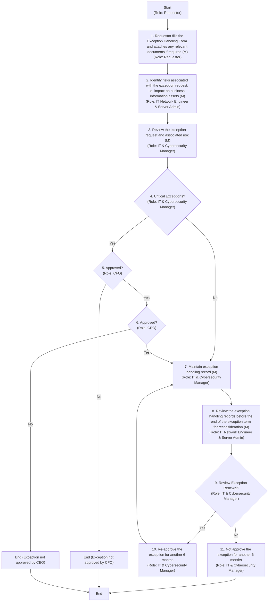

## Exception Handling

#### Purpose
The purpose of this procedure is to establish a structured approach for handling exceptions within Arabian Mills. By defining clear protocols and responsibilities, the organisation aims to manage non-compliance effectively, mitigating risks and ensuring operational continuity.
#### Scope
This procedure applies to all exceptions related to compliance with organisational standards, procedures, and regulations within Arabian Mills. It covers the process for requesting, reviewing, approving, and renewing exceptions, ensuring alignment with security policies and guidelines.
#### Procedure Reference
This procedure refers to the Exception Handling Guidelines of ARABIAN MILLS Information Security, ensuring alignment with overarching security policies and standards.
#### Objectives
The objectives of this procedure are to:
 Facilitate Exception Requests: Provide a structured process for requesting exceptions and documenting non-compliance.
 Assess Risks: Identify and evaluate risks associated with exceptions, ensuring informed decision-making.
 Review and Approve Exceptions: Establish a clear framework for reviewing, analysing, and approving exceptions.
 Maintain Records: Ensure comprehensive documentation and regular review of exception handling records.
#### Exception Handling Procedure
Effective exception handling is essential for managing non-compliance and mitigating risks. The following table outlines the activities and responsibilities involved in the exception handling process:

| S No. | Procedure description | Responsibility | Frequency |
| --- | --- | --- | --- |
| 1 | Fill Exception Handling Form: Requester fills the Exception Handling Form and attaches any relevant documents if required. | Preparer: Requester | As needed |
| 2 | Identify Risks: Identify risks associated with the exception required. Review exception details, assess impact on information assets, evaluate compliance risks, consult with asset owners, conduct risk analysis, document findings, and propose mitigation measures. | Preparer: IT Network and Server Admin | As needed |
| 3 | Review Exception: Review the exception request and associated risks. | Preparer: IT & Cybersecurity Manager | As needed |
| 4 | Approve Less Critical Exception: Approve less critical exceptions based on the review. | Reviewer : IT & Cybersecurity Manager | As needed |
| 5 | Approve Critical Exception (CFO): Approve critical exceptions based on the review. | Reviewer : Chief Finance Officer | As needed |
| 6 | Approve Critical Exception (CEO) : Final approval of critical exceptions after CFO approval. | Reviewer : CEO | As needed |
| 7 | Maintain Records: Maintain exception handling records. | Preparer: IT Network and Server Admin | Ongoing |
| 8 | Revisit Records: Revisit exception handling records before the end of 6 months to review if the exception can be revoked. | Preparer : IT Network and Server Admin | Every 6 months |
| 9 | Review Compliance ( IT & Cybersecurity Manager ): Before exception renewal, review if compliance is possible for the approved exception. | Preparer: IT & Cybersecurity Manager | Every 6 months |
| 10 | Re-approve Exception ( IT & Cybersecurity Manager ) : If exception cannot be revoked, re-approve the exception for another 6 months. | Reviewer : IT & Cybersecurity Manager | Every 6 months |
| 11 | Re-approve Exception (CFO) Final review and approve exception of for renewal. | Preparer : Chief Finance Officer | Every 6 months |
| 12 | Maintain Forms: All forms for requested exceptions is maintained for a period of 3 years. | Preparer: IT Network and Server Admin | Ongoing |

**[Diagram — Visio-EMF→PNG]:**

**Process Name:** Exception Handling Procedure  

**Roles / Swimlanes:**
- Requestor  
- IT Network Engineer & Server Admin  
- IT & Cybersecurity Manager  
- CFO  
- CEO  

---

### Steps

| Step # | Role                             | Action | Decision/Next Step |
|--------|----------------------------------|--------|--------------------|
| 1 | Requestor | Requestor fills the Exception Handling Form and attaches any relevant documents if required (M). | Proceeds to Step 2. |
| 2 | IT Network Engineer & Server Admin | Identify risks associated with the exception request, i.e. impact on business, information assets (M). | Proceeds to Step 3. |
| 3 | IT & Cybersecurity Manager | Review the exception request and associated risk. (M) | Decision: “Critical Exceptions?” If Yes → Step 4. If No → Step 7. |
| 4 | IT & Cybersecurity Manager | (Decision) Critical Exceptions. | If Yes → Step 5. If No → Step 7. |
| 5 | CFO | (Decision) Approved. | If Yes → Step 6. If No → back to Step 7 path (exception not approved; follows non‑critical approval flow). |
| 6 | CEO | (Decision) Approved. | If Yes → Step 7. If No → End (exception not approved). |
| 7 | IT & Cybersecurity Manager | Maintain exception handling record (M). | Proceeds to Step 8. |
| 8 | IT Network Engineer & Server Admin | Review the exception handling records before the end of the exception term for reconsideration (M). | Decision at Step 9. |
| 9 | IT & Cybersecurity Manager | (Decision) Review Exception Renewal. | If Yes → Step 7 (renewal approved; record maintained). If No → Step 10. |
| 10 | IT & Cybersecurity Manager | Re‑approve the exception for another 6 months. | Returns to Step 7 (record updated). |
| 11 | IT & Cybersecurity Manager | Not approve the exception for another 6 months. | Proceeds to End. |
| 12 | — | End. | — |

---

### Branching / Logic Trace

- After Step 3:  
  - If exception is a **Critical Exception** → Step 4 (Critical Exceptions decision).  
    - If **Approved** by CFO (Step 5 = Yes) → CEO approval (Step 6).  
      - If **Approved** by CEO (Step 6 = Yes) → Step 7.  
      - If CEO **Not Approved** (Step 6 = No) → End.  
    - If CFO **Not Approved** (Step 5 = No) → follow the non‑critical approval path (ultimately does not proceed to renewal; ends).  
  - If **Not a Critical Exception** → directly to Step 7.

- Renewal cycle:  
  - Step 7 → Step 8 → Step 9 (Review Exception Renewal).  
    - If **Yes** (renew) → Step 10 (re‑approve the exception for another 6 months) → back to Step 7 (record maintained).  
    - If **No** (do not renew) → Step 11 (not approve for another 6 months) → End.

---

#### Criteria for Critical and Less Critical Exceptions
To streamline the approval process for exceptions and reduce potential delays and bottlenecks, it is essential to define clear criteria for categorising exceptions as critical or less critical. These criteria help ensure that exceptions are handled efficiently, with appropriate oversight and review based on their potential impact on the organisation.
Critical Exceptions
Critical exceptions are those that pose significant risks or have a substantial impact on the organisation. They require thorough review and approval from senior management, including the CFO and CEO. The criteria for identifying critical exceptions include:
1. High Impact on Business Operations:
 Exceptions that could disrupt core business processes or lead to significant downtime.
 Involves systems or processes critical to the organisation's functionality.
2. Significant Security Risks:
 Exceptions that may expose sensitive data or compromise the security of information assets.
 Potential for data breaches or unauthorised access to critical systems.
3. Regulatory Compliance Implications:
 Exceptions that could result in non-compliance with legal, regulatory, or industry standards.
 Risk of penalties, fines, or legal action due to non-compliance.
4. Financial Implications:
 Exceptions with potential to incur substantial financial costs or losses.
 Involves high-value transactions or financial data.
5. Strategic Importance:
 Exceptions that affect strategic initiatives or long-term organisational goals.
 Involves key projects or partnerships.
Less Critical Exceptions
Less critical exceptions are those that pose manageable risks or have a limited impact on the organisation. They can be approved by the IT & Cybersecurity Manager, allowing for a more streamlined process. The criteria for identifying less critical exceptions include:
1. Low to Moderate Impact on Business Operations:
 Exceptions that have minimal effect on overall business processes.
 Involves non-critical systems or processes.
2. Manageable Security Risks:
 Exceptions with low risk of exposing sensitive data or compromising security.
 Can be mitigated with existing security controls.
3. Minimal Regulatory Compliance Implications:
 Exceptions that do not significantly affect compliance with legal or regulatory standards.
 Limited risk of penalties or legal action.
4. Limited Financial Implications:
 Exceptions with minor financial costs or losses.
 Involves low-value transactions or non-critical financial data.
5. Operational Necessity:
 Exceptions required for operational efficiency or temporary business needs.
 Involves routine processes or short-term adjustments.
#### Team Roles

| Role . | Responsibility |
| --- | --- |
| CEO | Final approval of exceptions. |
| IT Network and Server Admin | Identify risks associated with exceptions. Maintain records, revisit exception handling records, and maintain forms. |
| IT & Cybersecurity Manager | Review exception requests and re-approve exceptions. |
| Chief Finance Officer | Initial approval of exceptions and final review of compliance for renewals. |

#### Annexure

**[Diagram — Visio-EMF→PNG]:**

Exception Handling  
Form.pdf