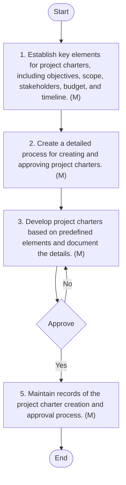

## Project Management

#### Purpose
The purpose of this document is to establish a comprehensive framework for managing IT projects within Arabian Mills. It aims to provide clear guidelines for project initiation, stakeholder engagement, post-implementation reviews, and documentation archiving, ensuring consistency and efficiency in project management practices.
#### Scope
This procedure applies to all IT-related projects undertaken by Arabian Mills. It encompasses the entire project lifecycle, including project charter creation and approval, stakeholder identification and engagement, post-implementation reviews, and documentation archiving.
#### Objectives
 Standardized Project Initiation: Ensure a consistent and standardized approach to creating and approving project charters.
 Effective Stakeholder Engagement: Implement clear methods for identifying and engaging stakeholders throughout the project lifecycle.
 Comprehensive Post-Implementation Reviews: Conduct thorough reviews to assess project success and document lessons learned.
 Documentation and Archiving: Maintain thorough records of project documentation to support future planning, audits, and compliance.
#### Responsibilities
1. IT & Cybersecurity Manager
 Oversee the project management process.
 Ensure project charters are created and approved consistently.
 Monitor stakeholder engagement and ensure alignment with project goals.
 Conduct post-implementation reviews and ensure documentation is archived.
2. IT Project Manager
 Create and document project charters.
 Identify and engage stakeholders.
 Conduct post-implementation reviews and document lessons learned.
 Archive and maintain project documentation.
3. Business Unit Head (BU)
 Provide input on project charters and stakeholder engagement.
 Ensure projects meet business objectives.
 Review and approve post-implementation review reports.
#### Project Charter Creation and Approval Procedure
This procedure outlines the process for creating and approving project charters, ensuring a standardized approach to initiating projects.

| S No. | Procedure description | Responsibility | Frequency |
| --- | --- | --- | --- |
| 1 | Define Project Charter Elements: Establish key elements for project charters, including objectives, scope, stakeholders, budget, and timeline. | Preparer: IT Project Manager | Annually |
| 2 | Document Project Charter Process: Create a detailed process for creating and approving project charters. | Preparer: IT Project Manager | Annually |
| 3 | Create Project Charter: Develop project charters based on predefined elements and document the details. | Preparer: IT Project Manager | As needed |
| 4 | Approve Project Charter: Obtain approval from the IT & Cybersecurity Manager for project charters. | Reviewer: IT & Cybersecurity Manager | As needed |
| 5 | Document Project Charter: Maintain records of the project charter creation and approval process. | Preparer: IT Project Manager | Ongoing |


**[Diagram — Visio-EMF→PNG]:**

**Process Name:** Project Charter Creation Procedure  

**Roles / Swimlanes:**
- IT Project Manager
- IT & Cybersecurity Manager

---

### Steps

| Step # | Role                     | Action                                                                                                                                                              | Decision/Next Step                                                                                 |
|--------|--------------------------|---------------------------------------------------------------------------------------------------------------------------------------------------------------------|----------------------------------------------------------------------------------------------------|
| 1      | IT Project Manager       | **Start**                                                                                                                                                           | Proceed to Step 2.                                                                                 |
| 2      | IT Project Manager       | **1. Establish key elements for project charters, including objectives, scope, stakeholders, budget, and timeline. (M)**                                           | Proceed to Step 3.                                                                                 |
| 3      | IT Project Manager       | **2. Create a detailed process for creating and approving project charters. (M)**                                                                                  | Proceed to Step 4.                                                                                 |
| 4      | IT Project Manager       | **3. Develop project charters based on predefined elements and document the details. (M)**                                                                          | Send charter for approval to IT & Cybersecurity Manager (Step 5).                                  |
| 5      | IT & Cybersecurity Manager | **Approve** (decision point).                                                                                                                                       | If **Yes**, go to Step 6. If **No**, return to Step 4 for revision.                               |
| 6      | IT Project Manager       | **5. Maintain records of the project charter creation and approval process. (M)**                                                                                   | Proceed to Step 7.                                                                                 |
| 7      | IT Project Manager       | **End**                                                                                                                                                             | Process completes.                                                                                |

**Yes/No Branches from “Approve” decision:**

- **Yes** → Step 6: “5. Maintain records of the project charter creation and approval process. (M)” → Step 7: End.
- **No** → back to Step 4: “3. Develop project charters based on predefined elements and document the details. (M)” (revise and resubmit for approval).

---



#### Stakeholder Identification and Engagement Procedure
This procedure details the process for identifying and engaging stakeholders, ensuring consistent and effective stakeholder management throughout the project lifecycle.

| S No. | Procedure description | Responsibility | Frequency |
| --- | --- | --- | --- |
| 1 | Identify Stakeholders: Establish criteria for identifying stakeholders relevant to IT projects. | Preparer: IT Project Manager | Annually |
| 2 | Document Stakeholder Engagement Process: Create a detailed process for engaging stakeholders, including communication methods and documentation guidelines. | Preparer: IT Project Manager | Annually |
| 3 | Engage Stakeholders: Communicate with stakeholders and involve them in project activities based on predefined criteria. | Preparer: IT Project Manager | As needed |
| 4 | Document Stakeholder Engagement: Maintain records of stakeholder interactions and engagement activities. | Preparer: IT Project Manager | Ongoing |
| 5 | Review Stakeholder Engagement: Regularly assess the effectiveness of stakeholder engagement and make necessary adjustments. | Preparer: IT Project Manager | Quarterly |


**[Diagram — Visio-EMF→PNG]:**

**Process Name:** Stakeholder Identification and Engagement Procedure  

**Roles / Swimlanes:**
- IT Project Manager  

---

### Steps

| Step # | Role              | Action | Decision/Next Step |
|--------|-------------------|--------|---------------------|
| 1      | IT Project Manager | Establish criteria for identifying stakeholders, relevant to the project. (M) | Proceed to Step 2 |
| 2      | IT Project Manager | Create a detailed process for managing stakeholders, including communication methods and communication guidelines. (M) | Proceed to Step 3 |
| 3      | IT Project Manager | Communicate with stakeholders and involve them in project decisions, based on predefined criteria. (M) | Proceed to Step 4 |
| 4      | IT Project Manager | Maintain records of stakeholder interactions and engagement activities. (M) | Proceed to Step 5 |
| 5      | IT Project Manager | Regularly assess the effectiveness of stakeholder engagement and make necessary adjustments. (M) | Proceed to End |
| End    | IT Project Manager | End | — |

There are no Yes/No branches; the flow is linear from Start → 1 → 2 → 3 → 4 → 5 → End.

---

```mermaid
graph TD

    A[Start] --> B[1. Establish criteria for identifying stakeholders, relevant to the project. (M)]
    B --> C[2. Create a detailed process for managing stakeholders, including communication methods and communication guidelines. (M)]
    C --> D[3. Communicate with stakeholders and involve them in project decisions, based on predefined criteria. (M)]
    D --> E[4. Maintain records of stakeholder interactions and engagement activities. (M)]
    E --> F[5. Regularly assess the effectiveness of stakeholder engagement and make necessary adjustments. (M)]
    F --> G[End]
```

#### Post-Implementation Review Procedure
This procedure outlines the process for conducting post-implementation reviews, ensuring a standardized approach to assessing project success and documenting lessons learned.

| S No. | Procedure description | Responsibility | Frequency |
| --- | --- | --- | --- |
| 1 | Define Post-Implementation Review Elements: Establish key elements for post-implementation reviews, including success criteria, lessons learned, and best practices. | Preparer: IT Project Manager | Annually |
| 2 | Document Post-Implementation Review Process: Create a detailed process for conducting post-implementation reviews. | Preparer: IT Project Manager | Annually |
| 3 | Conduct Post-Implementation Review: Assess project success and document lessons learned based on predefined elements. | Preparer: IT Project Manager | After each project |
| 4 | Approve Review Findings: Obtain approval from the IT & Cybersecurity Manager for post-implementation review findings. | Reviewer: IT & Cybersecurity Manager | After each project |
| 5 | Document Review Findings : Maintain records of the post-implementation review process and findings. | Preparer: IT Project Manager | Ongoing |


**[Diagram — Visio-EMF→PNG]:**

**Process Name:** Post-Implementation Review Procedure  

**Roles / Swimlanes:**
- IT Project Manager
- IT & Cybersecurity Manager  

| Step # | Role                    | Action                                                                                                                                           | Decision/Next Step                                                                                 |
|--------|-------------------------|--------------------------------------------------------------------------------------------------------------------------------------------------|----------------------------------------------------------------------------------------------------|
| 0      | IT Project Manager      | **Start**                                                                                                                                        | Proceed to Step 1                                                                                  |
| 1      | IT Project Manager      | 1. Establish key elements for post-implementation review, including success criteria, lessons learned, and other relevant metrics. \[M]        | Proceed to Step 2                                                                                  |
| 2      | IT Project Manager      | 2. Create a detailed process for conducting the post-implementation review. \[M]                                                                | Proceed to Step 3                                                                                  |
| 3      | IT Project Manager      | 3. Assess project success and document lessons learned based on predefined elements. \[M]                                                      | Submit for approval (Step 4)                                                                       |
| 4      | IT & Cybersecurity Manager | **Approve** (decision point)                                                                                                                    | If **Yes** → Step 5. If **No** → return to Step 3 for reassessment/revision and resubmission      |
| 5      | IT Project Manager      | 5. Maintain records of the post-implementation review process and findings. \[M]                                                                | Proceed to Step 6                                                                                  |
| 6      | IT Project Manager      | **End**                                                                                                                                          | Process complete                                                                                   |

```mermaid
graph TD

    A[Start] --> B[1. Establish key elements for post-implementation review, including success criteria, lessons learned, and other relevant metrics. (M)]
    B --> C[2. Create a detailed process for conducting the post-implementation review. (M)]
    C --> D[3. Assess project success and document lessons learned based on predefined elements. (M)]
    D --> E{Approve}
    E -->|Yes| F[5. Maintain records of the post-implementation review process and findings. (M)]
    F --> G[End]
    E -->|No| D
```

#### Documentation and Archiving Procedure
This procedure emphasizes the importance of maintaining thorough documentation of project activities and archiving records to support future planning, audits, and compliance.

| S No. | Procedure description | Responsibility | Frequency |
| --- | --- | --- | --- |
| 1 | Define Documentation Archiving Guidelines: Establish guidelines for archiving project documentation, including completeness and accuracy requirements. | Preparer: IT Project Manager | Annually |
| 2 | Document Archiving Process: Create a detailed process for archiving and maintaining project documentation. | Preparer: IT Project Manager | Annually |
| 3 | Archive Project Documentation: Maintain records of project activities and archive documentation based on predefined guidelines. | Preparer: IT Project Manager | As needed |
| 4 | Review Archived Documentation: Regularly review archived documentation to ensure completeness and accuracy. | Preparer: IT Project Manager | Quarterly |
| 5 | Ensure Accessibility: Make archived project documentation accessible to relevant stakeholders for review and audits. | Preparer: IT Project Manager | Ongoing |


**[Diagram — Visio-EMF→PNG]:**

**Process Name:** Documentation and Archiving Procedure  

**Roles / Swimlanes:**

- IT Project Manager  

---

### Steps

| Step # | Role             | Action | Decision/Next Step |
|--------|------------------|--------|--------------------|
| 1 | IT Project Manager | Establish guidelines for documenting project activities including completeness and accuracy requirements. (M) | Proceed to Step 2 |
| 2 | IT Project Manager | Create a detailed process for archiving and maintaining project documentation. (M) | Proceed to Step 3 |
| 3 | IT Project Manager | Maintain records of project activities and decisions in accordance with the defined procedures/guidelines. (M) | Proceed to Step 4 |
| 4 | IT Project Manager | Regularly review archived documentation to ensure completeness and accuracy. (M) | Proceed to Step 5 |
| 5 | IT Project Manager | Make archived project documents accessible for review and audits. (M) | Proceed to End |
| End | IT Project Manager | End | — |

*There are no Yes/No branches in this process; it is purely sequential.*

---

```mermaid
graph TD

    A[Start] --> B[1. Establish guidelines for documenting project activities including completeness and accuracy requirements. (M)]
    B --> C[2. Create a detailed process for archiving and maintaining project documentation. (M)]
    C --> D[3. Maintain records of project activities and decisions in accordance with the defined procedures/guidelines. (M)]
    D --> E[4. Regularly review archived documentation to ensure completeness and accuracy. (M)]
    E --> F[5. Make archived project documents accessible for review and audits. (M)]
    F --> G[End]
```