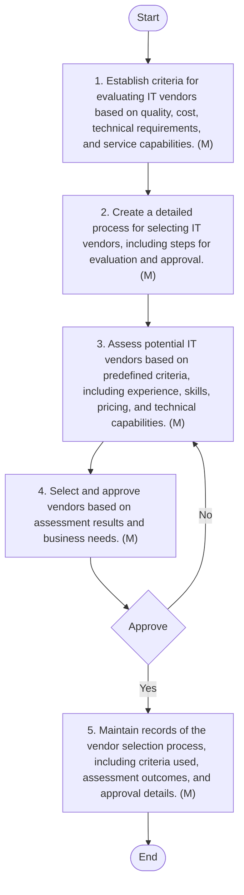
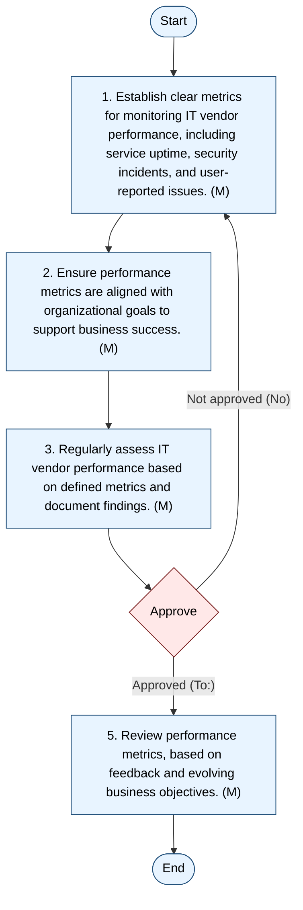

## Vendor Management

#### Purpose
The purpose of this document is to establish a comprehensive framework for managing IT vendors within Arabian Mills. It aims to provide clear guidelines for vendor selection, performance monitoring, and alignment with business objectives, ensuring consistency and efficiency in vendor management practices.
#### Scope
This procedure applies to all IT-related services and products procured from external vendors. It encompasses the entire vendor lifecycle, including selection, evaluation, performance monitoring, and alignment with business objectives.
#### Objectives
 Standardized Vendor Selection: Ensure a consistent and fair process for selecting IT vendors based on predefined criteria.
 Performance Monitoring: Implement clear metrics to monitor and assess IT vendor performance.
 Alignment with Business Objectives: Align IT vendor performance metrics with organizational goals to ensure vendors contribute to business success.
 Documentation and Transparency: Maintain thorough documentation of vendor selection and performance monitoring processes to enhance accountability and transparency.
#### Responsibilities
1. IT & Cybersecurity Manager
 Oversee the vendor management process.
 Ensure vendor selection criteria and procedures are consistently applied.
 Monitor vendor performance and ensure alignment with business objectives.
 Approve vendor selection and performance metrics.
2. IT Team
 Conduct vendor selection and evaluation.
 Define and document performance metrics.
 Monitor and report vendor performance.
 Maintain vendor management records.
3. Business Unit Head (BU)
 Provide input on vendor selection criteria and performance metrics.
 Ensure vendors meet business objectives.
 Review and approve vendor performance reports.
#### Vendor Selection Procedure
This procedure outlines the process for selecting IT vendors, ensuring a standardized approach to evaluating and approving vendors based on predefined criteria.

| S No. | Procedure description | Responsibility | Frequency |
| --- | --- | --- | --- |
| 1 | Define Vendor Selection Criteria: Establish criteria for evaluating IT vendors based on business needs, technical requirements, and vendor capabilities. | Preparer: IT Network and Server Admin | Annually |
| 2 | Document Vendor Selection Process: Create a detailed process for selecting IT vendors, including steps for evaluation and approval. | Preparer: IT Network and Server Admin | Annually |
| 3 | Evaluate Vendors: Assess potential IT vendors based on predefined criteria, including experience, reliability, cost, and technical capabilities. | Preparer: IT Network and Server Admin | As needed |
| 4 | Approve Vendor Selection: Obtain approval from the IT & Cybersecurity Manager for selected vendors. | Reviewer: IT & Cybersecurity Manager | As needed |
| 5 | Document Vendor Selection: Maintain records of the vendor selection process, including evaluation criteria, assessment results, and approvals. | Preparer: IT Network and Server Admin | Ongoing |

**[Diagram — Visio-EMF→PNG]:**

**Process Name:** Vendor Selection Procedure  

**Roles / Swimlanes:**
- IT Network and Server Admin
- IT & Cyber-security Manager

---

### Steps

| Step # | Role                        | Action                                                                                                                                                                           | Decision / Next Step                                                                                       |
|--------|-----------------------------|----------------------------------------------------------------------------------------------------------------------------------------------------------------------------------|------------------------------------------------------------------------------------------------------------|
| Start  | IT Network and Server Admin | Start                                                                                                                                                                            | Proceed to Step 1                                                                                          |
| 1      | IT Network and Server Admin | 1. Establish criteria for evaluating IT vendors based on quality, cost, technical requirements, and service capabilities. (M)                                                  | Proceed to Step 2                                                                                          |
| 2      | IT Network and Server Admin | 2. Create a detailed process for selecting IT vendors, including steps for evaluation and approval. (M)                                                                        | Proceed to Step 3                                                                                          |
| 3      | IT Network and Server Admin | 3. Assess potential IT vendors based on predefined criteria, including experience, skills, pricing, and technical capabilities. (M)                                            | Proceed to Step 4                                                                                          |
| 4      | IT Network and Server Admin | 4. Select and approve vendors based on assessment results and business needs. (M)                                                                                               | Go to Decision “Approve” (IT & Cyber-security Manager)                                                    |
| Dec-1  | IT & Cyber-security Manager | Approve                                                                                                                                                                          | **Yes:** Proceed to Step 5.  **No:** Return to Step 3 (reassess potential IT vendors).                    |
| 5      | IT Network and Server Admin | 5. Maintain records of the vendor selection process, including criteria used, assessment outcomes, and approval details. (M)                                                   | Proceed to End                                                                                             |
| End    | IT & Cyber-security Manager | End                                                                                                                                                                              | Process completed                                                                                          |

---

### Decision Branches

- From **Approve** (IT & Cyber-security Manager):
  - **Yes** → Step 5: Maintain records of the vendor selection process, including criteria used, assessment outcomes, and approval details. (M)
  - **No** → Step 3: Assess potential IT vendors based on predefined criteria, including experience, skills, pricing, and technical capabilities. (M)

---

### Mermaid.js Flow

#### Performance Metrics and Alignment
This procedure details the process for defining and aligning performance metrics with business objectives, ensuring IT vendor performance is consistently monitored and assessed.

| S No. | Procedure description | Responsibility | Frequency |
| --- | --- | --- | --- |
| 1 | Define Performance Metrics: Establish clear metrics for monitoring IT vendor performance, including service quality, delivery timelines, and cost-effectiveness. | Preparer: IT Network and Server Admin | Annually |
| 2 | Align Metrics with Business Objectives: Ensure performance metrics are aligned with organizational goals to support business success. | Preparer: IT Network and Server Admin | Annually |
| 3 | Monitor Vendor Performance: Regularly assess IT vendor performance based on predefined metrics and document findings. | Preparer: IT Network and Server Admin | Quarterly |
| 4 | Report Vendor Performance: Provide performance reports to the IT & Cybersecurity Manager and BU Head for review and approval. | Reviewer: IT & Cybersecurity Manager | Quarterly |
| 5 | Update Performance Metrics: Revise performance metrics based on feedback and evolving business objectives. | Preparer: IT Network and Server Admin | Annually |

**[Diagram — Visio-EMF→PNG]:**

Process Name: **Performance Metric and Alignment Procedure**

Roles / Swimlanes:
- **IT Network and Server Admin**
- **IT & Cybersecurity Manager**

| Step # | Role                         | Action                                                                                                                                                 | Decision/Next Step                                                                                                                                                                            |
|--------|------------------------------|--------------------------------------------------------------------------------------------------------------------------------------------------------|----------------------------------------------------------------------------------------------------------------------------------------------------------------------------------------------|
| Start  | IT Network and Server Admin  | **Start**                                                                                                                                              | Proceed to step **1. Establish clear metrics for monitoring IT vendor performance, including service uptime, security incidents, and user-reported issues. (M)**                            |
| 1      | IT Network and Server Admin  | **1. Establish clear metrics for monitoring IT vendor performance, including service uptime, security incidents, and user-reported issues. (M)**       | Go to step **2. Ensure performance metrics are aligned with organizational goals to support business success. (M)**                                                                          |
| 2      | IT Network and Server Admin  | **2. Ensure performance metrics are aligned with organizational goals to support business success. (M)**                                              | Go to step **3. Regularly assess IT vendor performance based on defined metrics and document findings. (M)**                                                                                |
| 3      | IT Network and Server Admin  | **3. Regularly assess IT vendor performance based on defined metrics and document findings. (M)**                                                     | Send for approval to **Approve** decision (IT & Cybersecurity Manager).                                                                                                                     |
| Decision: Approve | IT & Cybersecurity Manager | **Approve** (decision diamond). The manager reviews the assessed metrics and decides whether to approve.                                               | **Approved path (arrow label: “To:”):** proceed to step **5. Review performance metrics, based on feedback and evolving business objectives. (M)**. **Not approved path (“No”):** loop back to step **1. Establish clear metrics for monitoring IT vendor performance, including service uptime, security incidents, and user-reported issues. (M)**. |
| 5      | IT Network and Server Admin  | **5. Review performance metrics, based on feedback and evolving business objectives. (M)**                                                             | Go to **End**.                                                                                                                                                                               |
| End    | IT Network and Server Admin  | **End**                                                                                                                                                 | Process complete.                                                                                                                                                                            |

