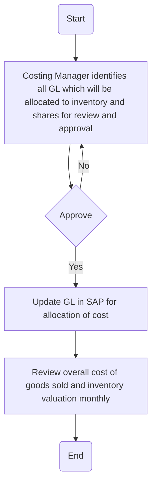

### Process Name:
Identify Cost of Allocation

### Roles (Swimlanes):
1. Costing Manager
2. CFO

### Steps in Markdown Table:

| Step # | Role          | Action                                                                       | Next Step/Logic                     |
|--------|---------------|------------------------------------------------------------------------------|-------------------------------------|
| 1      | Costing Manager | Identify all GL (General Ledger) which will be allocated to inventory and shares for review and approval. | 2                                   |
| 2      | CFO           | Approve                                                                      | Yes -> 3, No -> 1                   |
| 3      | Costing Manager | Update GL in SAP for allocation of cost                                      | 4                                   |
| 4      | Costing Manager | Review overall cost of goods sold and inventory valuation monthly           | End                                 |

### Logic in Mermaid.js:

