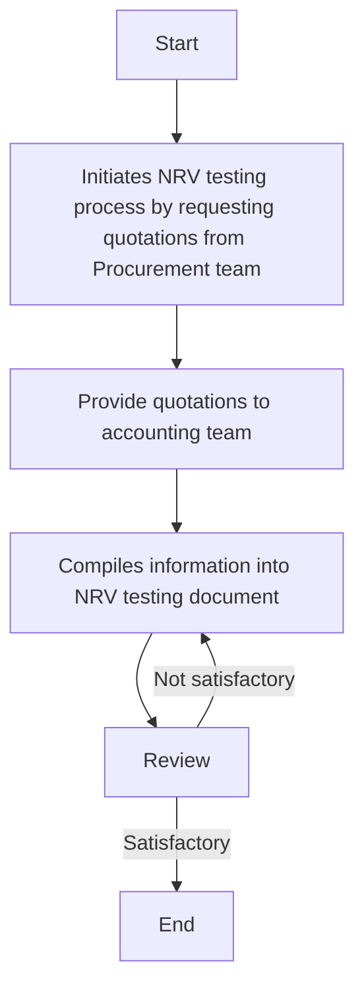

### Analysis of the Flowchart

#### 1. Process Name
- NRV Testing

#### 2. Roles (Swimlanes)
- GL Manager
- Supply Chain Team
- CFO
- Accounting Manager

#### 3. Steps in Markdown Table

| Step # | Role              | Action                                                                                     | Next Step/Logic |
|--------|-------------------|--------------------------------------------------------------------------------------------|-----------------|
| 1      | GL Manager        | Initiates the NRV testing process by requesting quotations from the Procurement team (M). | Step 2          |
| 2      | Supply Chain Team | Provide quotations to accounting team (M).                                                | Step 3          |
| 3      | GL Manager        | Once the quotations are received, compiles this information into a working document designed for NRV testing (M). | Step 4          |
| 4      | CFO               | Review                                                                                     | Step 5          |
| 5      | CFO               | Decision point: If review is satisfactory, process ends; if not, return to Step 3.         | End or Step 3   |
| 6      | CFO               | End                                                                                        |                 |

#### 4. Logic as a Mermaid.js Code Block

In this logic, decisions are clearly traced with paths explicitly marked for a satisfactory or unsatisfactory review resulting in looping back as needed.