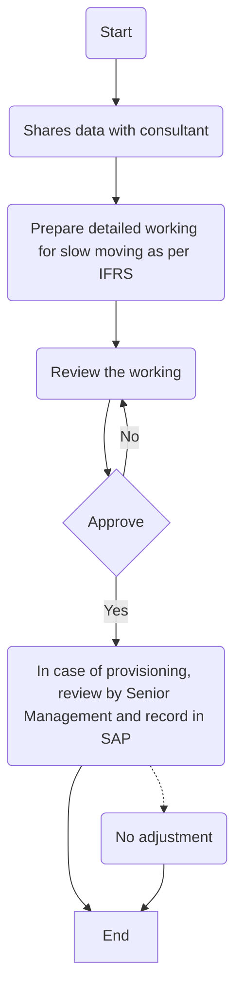

### Flowchart Analysis

1. **Process Name**: Slow-moving

2. **Roles (Swimlanes)**:
   - GL Manager
   - Accounting Manager
   - CFO
   - Consultant

3. **Steps in a Markdown Table**:

| Step # | Role               | Action                                                               | Next Step/Logic                                   |
|--------|--------------------|----------------------------------------------------------------------|---------------------------------------------------|
| 1      | GL Manager         | Start                                                                | Step 2                                            |
| 2      | GL Manager         | Shares data with consultant                                          | Step 3                                            |
| 3      | Consultant         | Prepare detailed working for slow moving as per IFRS (M)             | Step 4                                            |
| 4      | Accounting Manager | Review the working (M)                                               | Step 5                                            |
| 5      | CFO                | Approve                                                              | If Yes: Step 6 / If No: Step 4                    |
| 6      | CFO                | In case of provisioning, review by Senior Management and record in SAP | End (For Adjustment) / Step 7 (For No Adjustment) |
| 7      | CFO                | No adjustment                                                        | End                                               |

4. **Mermaid.js Code Block**:

