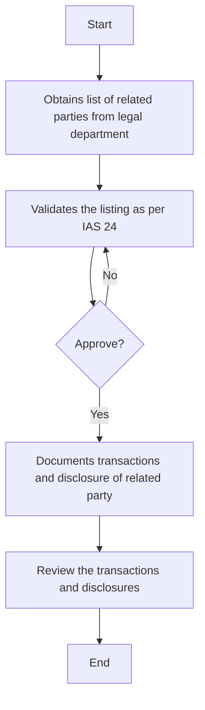

### Process Analysis

1. **Process Name**: Related Party

2. **Roles (Swimlanes)**:
   - Accounting Manager
   - CFO
   - AR Manager

3. **Steps in Table Format**:

| Step # | Role              | Action                                                      | Next Step/Logic    |
|--------|-------------------|-------------------------------------------------------------|--------------------|
| 1      | Accounting Manager| Obtains list of related parties from legal department       | Step 2             |
| 2      | Accounting Manager| Validates the listing as per IAS 24                         | Step 3             |
| 3      | CFO               | Approve                                                     | Yes: Step 4 / No: Step 2 |
| 4      | AR Manager        | Documents transactions and disclosure of related party      | Step 5             |
| 5      | Accounting Manager| Review the transactions and disclosures                     | End                |

4. **Mermaid.js Code Block**:

