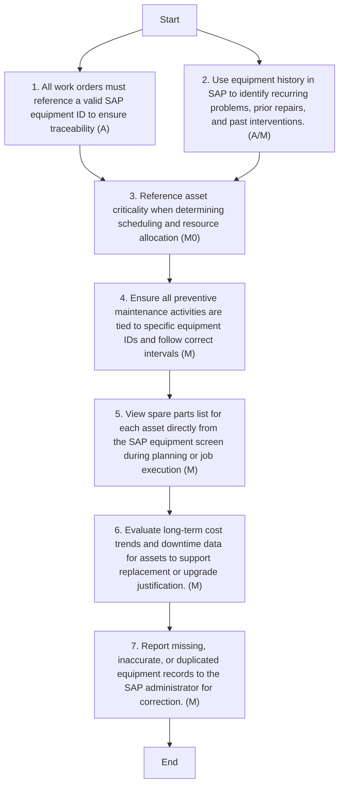

### Analysis of the Flowchart

1. **Process Name**: Asset Inventory

2. **Roles (Swimlanes)**:
   - Maintenance Planner
   - Maintenance Manager

3. **Steps in a Markdown Table:**

| Step # | Role               | Action                                                                 | Next Step/Logic  |
|--------|--------------------|------------------------------------------------------------------------|------------------|
| 1      | Maintenance Planner| All work orders must reference a valid SAP equipment ID to ensure traceability (A) | Step 3           |
| 2      | Maintenance Manager| Use equipment history in SAP to identify recurring problems, prior repairs, and past interventions. (A/M) | Step 3           |
| 3      | Maintenance Planner| Reference asset criticality when determining scheduling and resource allocation (M0) | Step 4           |
| 4      | Maintenance Planner| Ensure all preventive maintenance activities are tied to specific equipment IDs and follow correct intervals (M) | Step 5           |
| 5      | Maintenance Planner| View spare parts list for each asset directly from the SAP equipment screen during planning or job execution (M) | Step 6           |
| 6      | Maintenance Manager| Evaluate long-term cost trends and downtime data for assets to support replacement or upgrade justification. (M) | Step 7           |
| 7      | Maintenance Planner| Report missing, inaccurate, or duplicated equipment records to the SAP administrator for correction. (M) | End              |

4. **Mermaid.js Code Block:**

