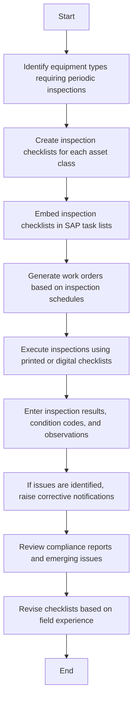

### Analysis of Flowchart

1. **Process Name**
   - Equipment Inspection and Checklist

2. **Roles (Swimlanes)**
   - Maintenance
   - SAP PM Administrator
   - Technician

3. **Steps in Markdown Table**

| Step # | Role                  | Action                                                                                           | Next Step/Logic          |
|--------|-----------------------|--------------------------------------------------------------------------------------------------|--------------------------|
| 1      | Maintenance           | Identify equipment types requiring periodic inspections based on OEM guidance, failure history, and criticality. (M) | Step 2                   |
| 2      | Maintenance           | Create inspection checklists for each asset class or inspection type (e.g., mechanical, lubrication, safety). (M) | Step 3                   |
| 3      | SAP PM Administrator  | Embed inspection checklists in SAP task lists or work order operation texts to standardize execution. (M) | Step 4                   |
| 4      | SAP PM Administrator  | Generate work orders based on inspection schedules and assign to technicians. (M)                | Step 5                   |
| 5      | Technician            | Execute inspections using printed or digital checklists. Identify non-conformities or potential failures. (M) | Step 6                   |
| 6      | Technician            | Enter inspection results, condition codes, observations, and follow-up needs directly into the work order feedback. (M) | Step 7                   |
| 7      | Maintenance           | If issues are identified, raise corrective notifications and initiate work orders through SAP. (M) | Step 8                   |
| 8      | Maintenance           | Review compliance reports, missed inspections, and emerging issues for proactive intervention. (M) | Step 9                   |
| 9      | Maintenance           | Revise checklists based on field experience, failures, or asset upgrades. (M)                     | End                      |

4. **Mermaid.js Code Block**

This structured logic and diagram provide a clear pathway through the steps involved in the Equipment Inspection and Checklist process.