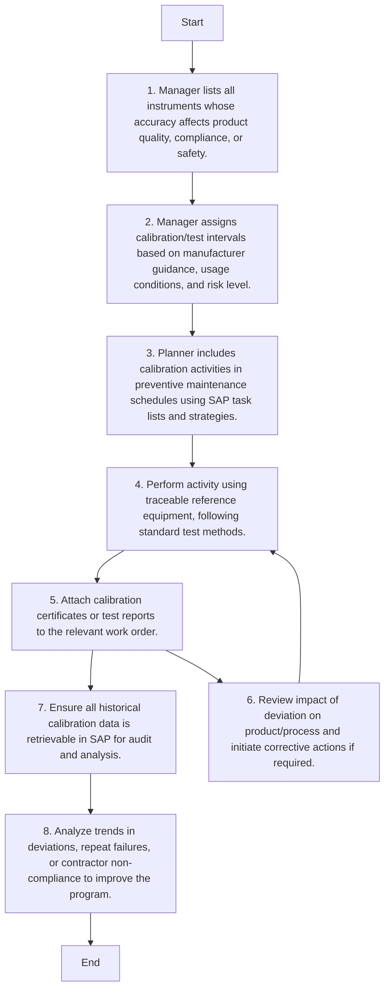

Sure, here is the analysis of the flowchart:

### 1. Process Name:
**Equipment Calibration and Testing**

### 2. Roles (Swimlanes):
- Maintenance
- External Contractor
- SAP PM Administrator
- Maintenance Engineer

### 3. Markdown Table of Steps:

| Step # | Role                 | Action                                                                                  | Next Step/Logic           |
|--------|----------------------|-----------------------------------------------------------------------------------------|---------------------------|
| 1      | Maintenance          | Manager lists all instruments whose accuracy affects product quality, compliance, or safety. | Step 2                    |
| 2      | Maintenance          | Manager assigns calibration/test intervals based on manufacturer guidance, usage conditions, and risk level. | Step 3                    |
| 3      | Maintenance          | Planner includes calibration activities in preventive maintenance schedules using SAP task lists and strategies. | Step 4                    |
| 4      | External Contractor  | Perform activity using traceable reference equipment, following standard test methods.  | Step 5                    |
| 5      | SAP PM Administrator | Attach calibration certificates or test reports to the relevant work order.             | Step 7                    |
| 6      | Maintenance Engineer | Review impact of deviation on product/process and initiate corrective actions if required. | Step 4 (via decision logic) |
| 7      | SAP PM Administrator | Ensure all historical calibration data is retrievable in SAP for audit and analysis.    | Step 8                    |
| 8      | Maintenance Engineer | Analyze trends in deviations, repeat failures, or contractor non-compliance to improve the program. | End                       |

### 4. Mermaid.js Code Block:

This flowchart describes an equipment calibration and testing process with specific roles and actions taken at each step.