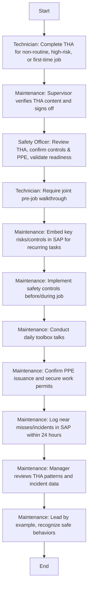

Here's the analysis of the flowchart:

### 1. Process Name
- **Maintenance Related Risks**

### 2. Roles (Swimlanes)
- Technician
- Maintenance
- Safety Officer

### 3. Steps in a Markdown Table

```markdown
| Step # | Role         | Action                                                                                                                                          | Next Step/Logic |
|--------|--------------|-------------------------------------------------------------------------------------------------------------------------------------------------|-----------------|
| 1      | Technician   | Before executing any non-routine, high-risk, or first-time job, complete a THA identifying potential hazards and mitigation measures.            | Step 2          |
| 2      | Maintenance  | Supervisor verifies THA content for thoroughness, checks mitigation measures, and signs off before job start.                                    | Step 3          |
| 3      | Safety Officer | For high-risk or first-time jobs, the Safety Officer must review the THA, confirm adequacy of controls and PPE, and validate job readiness.   | Step 4          |
| 4      | Technician   | For tasks never performed before, require joint pre-job walkthrough by technician, supervisor, engineer, and Safety Officer.                     | Step 5          |
| 5      | Maintenance  | For recurring tasks, key risks and controls identified in past THAs must be embedded into PM task lists or standard CM procedures in SAP.       | Step 6          |
| 6      | Maintenance  | Ensure that all safety controls defined in the THA are implemented before and during job execution, including LOTO, PPE, tools, and access control. | Step 7          |
| 7      | Maintenance  | Conduct daily toolbox talks highlighting planned jobs, THA summaries, PPE requirements, and lessons from past incidents.                         | Step 8          |
| 8      | Maintenance  | Confirm that correct PPE is issued and worn. Secure appropriate work permits before starting jobs that require isolation, hot work, confined entry, or elevation. | Step 9          |
| 9      | Maintenance  | Any near miss, injury, or unsafe act/condition must be logged in SAP within 24 hours using the incident reporting module.                        | Step 10         |
| 10     | Maintenance  | Manager reviews THA patterns and incident data to identify systemic risks and recommend engineering or procedural interventions.                 | Step 11         |
| 11     | Maintenance  | Lead by example, recognize safe behaviors, enforce accountability, and ensure full integration of safety into planning and execution routines.  | End             |
```

### 4. Logic as Mermaid.js Code Block



This provides a clear logic flow that traces each decision and step accurately.