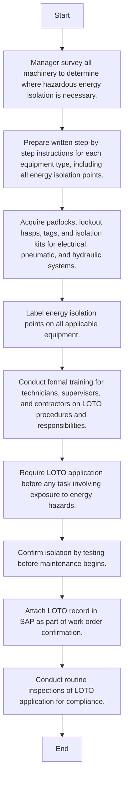

### Analysis of the Flowchart

#### Process Name:
Lockout/Tagout (LOTO)

#### Roles (Swimlanes):
1. Maintenance
2. Safety Officer
3. Technician
4. SAP PM Administrator

#### Steps in Markdown Table:

| Step # | Role               | Action                                                                                              | Next Step/Logic                     |
|--------|--------------------|-----------------------------------------------------------------------------------------------------|-------------------------------------|
| 1      | Maintenance        | Manager survey all machinery to determine where hazardous energy isolation is necessary.            | Step 2                              |
| 2      | Maintenance        | Prepare written step-by-step instructions for each equipment type, including all energy isolation points. | Step 3                              |
| 3      | Safety Officer     | Acquire padlocks, lockout hasps, tags, and isolation kits for electrical, pneumatic, and hydraulic systems.     | Step 4                              |
| 4      | Maintenance        | Label energy isolation points on all applicable equipment.                                          | Step 5                              |
| 5      | Maintenance        | Conduct formal training for technicians, supervisors, and contractors on LOTO procedures and responsibilities. | Step 6                              |
| 6      | Maintenance        | Require LOTO application before any task involving exposure to energy hazards.                      | Step 7                              |
| 7      | Technician         | Confirm isolation by testing before maintenance begins.                                             | Step 8                              |
| 8      | SAP PM Administrator | Attach LOTO record in SAP as part of work order confirmation.                                      | Step 9                              |
| 9      | Maintenance        | Conduct routine inspections of LOTO application for compliance.                                     | End                                 |

#### Logic in Mermaid.js Code Block:

This Mermaid.js code illustrates the flow of actions and decisions within the Lockout/Tagout (LOTO) process, ensuring clear navigation through each step.