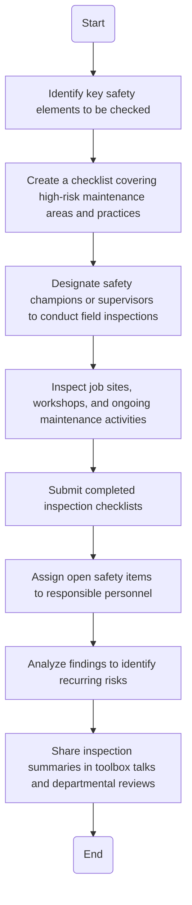

### Analysis of the Flowchart

1. **Process Name:**
   - Workplace Safety Inspections

2. **Roles (Swimlanes):**
   - Safety Officer
   - Supervisor
   - Inspector
   - Maintenance Manager

3. **Steps in a Markdown Table:**

| Step # | Role              | Action                                                                 | Next Step/Logic |
|--------|-------------------|------------------------------------------------------------------------|-----------------|
| 1      | Safety Officer    | Identify key safety elements to be checked (e.g., PPE compliance, LOTO, tools, housekeeping, fire hazards). | Step 2          |
| 2      | Safety Officer    | Create a checklist covering high-risk maintenance areas and practices. Include reference to applicable standards (e.g., LOTO, THA, PPE). | Step 3          |
| 3      | Safety Officer    | Designate safety champions or supervisors to conduct field inspections with trained oversight. | Step 4          |
| 4      | Supervisor        | Inspect job sites, workshops, and ongoing maintenance activities. Document observations and take immediate action on unsafe conditions. | Step 5          |
| 5      | Supervisor        | Submit completed inspection checklists to the Safety Officer.   | Step 6          |
| 6      | Safety Officer    | Assign open safety items to responsible personnel for closure with due dates. | Step 7          |
| 7      | Safety Officer    | Analyze findings to identify recurring risks and recommend improvements in procedures or training. | Step 8          |
| 8      | Maintenance Manager | Share inspection summaries in toolbox talks and departmental safety reviews. | End             |

4. **Mermaid.js Code Block:**

