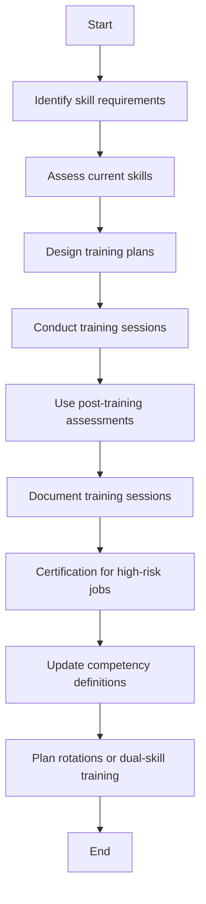

### Analysis of the Flowchart

1. **Process Name**: Personnel Skill Development

2. **Roles (Swimlanes)**:
   - Maintenance
   - Training Coordinator
   - HR

3. **Steps in a Markdown Table**:

   | Step # | Role                | Action                                                                 | Next Step/Logic              |
   |--------|---------------------|------------------------------------------------------------------------|------------------------------|
   | 1      | Maintenance         | Identify skill requirements for each role across technical, safety, system, and procedural domains.    | Step 2                       |
   | 2      | Maintenance         | Assess current skills of all personnel against the competency matrix using observation, testing, and supervisor input. | Step 3                       |
   | 3      | Maintenance         | Design training plans to close identified gaps, including on-the-job training, classroom, and external courses.     | Step 4                       |
   | 4      | Maintenance         | Conduct sessions covering equipment maintenance, safety protocols, SAP usage, calibration, and troubleshooting.     | Step 5                       |
   | 5      | Maintenance         | Use post-training assessments, job observations, and feedback to verify improvement in competence.     | Step 6                       |
   | 6      | Maintenance         | Document all training sessions, attendance, results, and certifications in employee files and digital system (e.g., SAP or HRMS). | Step 7                       |
   | 7      | Maintenance         | Technicians must be certified before performing high-risk jobs (e.g., electrical isolation, confined space entry).   | Step 8                       |
   | 8      | Maintenance         | Update competency definitions and required skill levels as equipment or practices evolve.     | Step 9                       |
   | 9      | Maintenance         | Plan rotations or dual-skill training (e.g., mechanical + calibration) to build team flexibility and reduce dependency. | End                          |

4. **Mermaid.js Code Block**:

