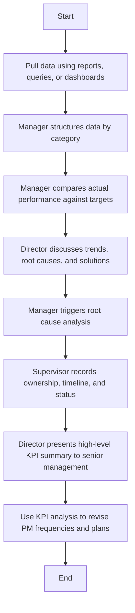

### Flowchart Analysis

1. **Process Name:** Reporting and Analysis

2. **Roles (Swimlanes):**
   - Planner
   - Maintenance

3. **Steps in Markdown Table:**

   | Step # | Role       | Action                                                                                          | Next Step/Logic |
   |--------|------------|-------------------------------------------------------------------------------------------------|-----------------|
   | 1      | Planner    | Pull data using reports, queries, or dashboards aligned with defined KPI metrics.              | Step 2          |
   | 2      | Maintenance| Manager structures data by category and formats it for review meetings.                       | Step 3          |
   | 3      | Maintenance| Manager compares actual performance against targets, baselines, or prior periods. Highlights trends. | Step 4          |
   | 4      | Maintenance| Director discusses trends, root causes, and solutions with maintenance staff.                  | Step 5          |
   | 5      | Maintenance| Manager triggers root cause analysis for underperforming KPIs.                                | Step 6          |
   | 6      | Maintenance| Supervisor records ownership, timeline, and status of action items from reviews.               | Step 7          |
   | 7      | Maintenance| Director presents high-level KPI summary to senior management with analysis and improvement plans. | Step 8          |
   | 8      | Maintenance| Use KPI analysis to revise PM frequencies, training needs, manpower plans, and budget inputs.  | End             |

4. **Mermaid.js Code Block:**

This provides a structured view of the flowchart, capturing each step, role, and decision path within the "Reporting and Analysis" process.