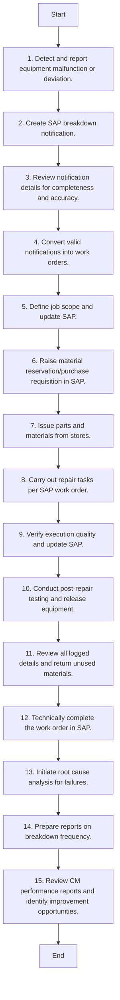

### Analysis of the Flowchart

#### 1. Process Name

- **Corrective Maintenance**

#### 2. Roles (Swimlanes)

- Operator
- Technician
- Supervisor
- Maintenance
- Stores Team
- SAP PM Administrator

#### 3. Steps in a Markdown Table

| Step # | Role              | Action                                                                                               | Next Step/Logic            |
|--------|-------------------|------------------------------------------------------------------------------------------------------|----------------------------|
| 1      | Operator          | Detect and report equipment malfunction or deviation. (M)                                            | Step 2                     |
| 2      | Technician        | Create SAP breakdown notification with equipment ID, problem description, and timestamp. (A/M)       | Step 3                     |
| 3      | Supervisor        | Review the notification details for completeness and accuracy (M)                                    | Step 4                     |
| 4      | Maintenance       | Convert valid notifications into work orders. Assign priority using the plant priority matrix. (M)   | Step 5                     |
| 5      | Maintenance       | Define job scope, resource requirements, tools, and duration. Update this information in SAP. (M)    | Step 6                     |
| 6      | Supervisor        | Raise a material reservation or purchase requisition in SAP for required spares, tools, or consumables (M) | Step 7                |
| 7      | Stores Team       | Issue parts and materials from stores against the work order. (M)                                    | Step 8                     |
| 8      | Technician        | Carry out repair tasks per SAP work order. Record task completion and observations. (M)              | Step 9                     |
| 9      | Technician        | Verify execution quality, ensure LOTO and safety compliance, and update SAP with work status. (A/M)  | Step 10                    |
| 10     | Technician        | Conduct post-repair testing and release the equipment for operation. (M)                             | Step 11                    |
| 11     | Technician        | Review all logged details. Return unused materials to stores and record returns in SAP. (M)          | Step 12                    |
| 12     | SAP PM Administrator | Technically complete the work order in SAP, entering final fault codes and resolution status. (A/M) | Step 13                    |
| 13     | Maintenance       | Initiate root cause analysis for repeated or critical failures. Document findings and attach to SAP work order (M) | Step 14         |
| 14     | SAP PM Administrator | Prepare reports on breakdown frequency and common failure modes using SAP data. (M)                  | Step 15                    |
| 15     | Maintenance       | Review CM performance reports and identify improvement opportunities. (A/M)                          | End                        |

#### 4. Mermaid.js Code Block

