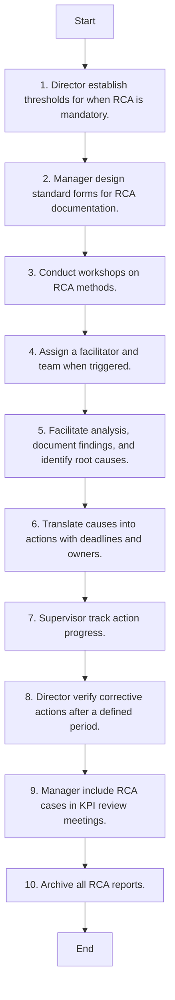

### Analysis

#### 1. Process Name
- Root Cause Analysis

#### 2. Roles (Swimlanes)
- Maintenance
- RCA Team
- SAP PM Administrator

#### 3. Steps in a Markdown Table

| Step # | Role                | Action                                                                 | Next Step/Logic        |
|--------|---------------------|------------------------------------------------------------------------|------------------------|
| Start  | Maintenance         | Start                                                                  | 1                      |
| 1      | Maintenance         | Director establish thresholds for when RCA is mandatory.               | 2                      |
| 2      | Maintenance         | Manager design standard forms for RCA documentation.                   | 3                      |
| 3      | Maintenance         | Conduct workshops on RCA methods.                                      | 4                      |
| 4      | Maintenance         | Assign a facilitator and team when triggered.                          | 5                      |
| 5      | RCA Team            | Facilitate analysis, document findings, and identify root causes.      | 6                      |
| 6      | RCA Team            | Translate causes into actions with deadlines and owners.               | 7                      |
| 7      | Maintenance         | Supervisor track action progress.                                      | 8                      |
| 8      | Maintenance         | Director verify corrective actions after a defined period.             | 9                      |
| 9      | Maintenance         | Manager include RCA cases in KPI review meetings.                      | 10                     |
| 10     | SAP PM Administrator| Archive all RCA reports.                                               | End                    |
| End    | SAP PM Administrator| End                                                                    |                        |

#### 4. Mermaid.js Code Block

